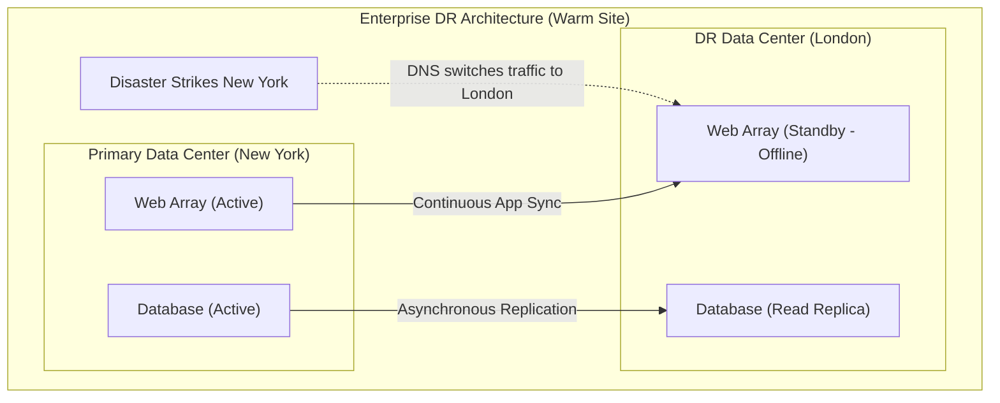
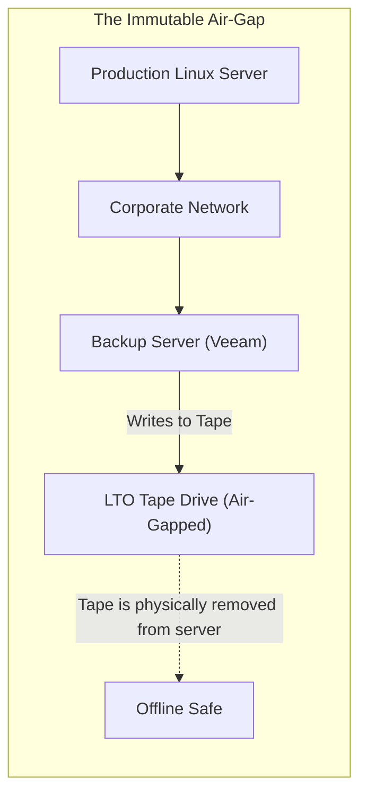
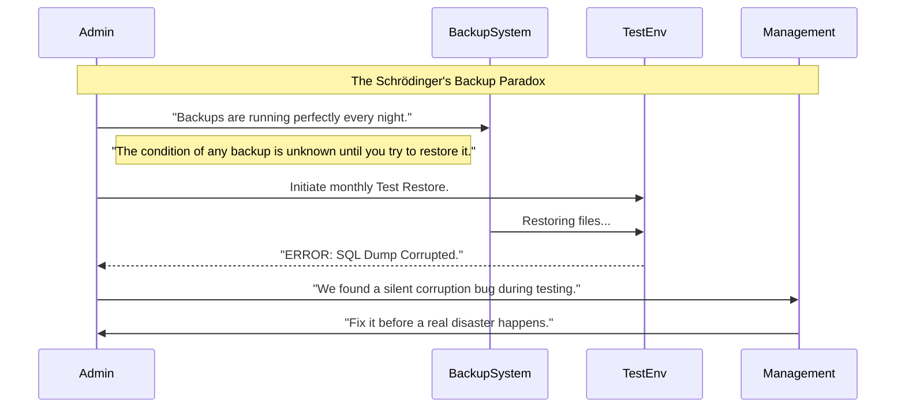

# CHAPTER 68 — DISASTER RECOVERY PLANNING

---

## 1. Introduction

### Why This Topic Exists
You know how to copy files with `rsync` and bundle them with `tar`. But having a backup script is not the same thing as having a **Disaster Recovery (DR) Plan**. What happens if a catastrophic ransomware attack encrypts your primary server AND the backup server? What happens if a junior administrator accidentally runs `rm -rf /` and deletes the database? Disaster Recovery Planning is the architectural and philosophical framework that ensures a business survives the worst-case scenario.

### Why Linux Administrators Use It
Linux administrators design DR plans to protect data against four specific threats:
1. **Hardware Failure:** A physical hard drive dies or a server catches fire.
2. **Human Error:** An administrator accidentally overwrites a configuration file.
3. **Malicious Actors:** Hackers or disgruntled employees delete or encrypt data.
4. **Site-Wide Disasters:** A hurricane or power grid failure takes down the entire data center.

### Why Companies Care About It
Survival. If a bank loses its customer database and has no backups, the bank ceases to exist. Companies measure their DR success in two critical business metrics: **RPO (Recovery Point Objective)**—how much data they are willing to lose, and **RTO (Recovery Time Objective)**—how long they can afford to be offline before going bankrupt.

---

## 2. Learning Objectives

By the end of this chapter, you will be able to:
- Define RPO (Recovery Point Objective) and RTO (Recovery Time Objective).
- Explain the 3-2-1 Backup Rule.
- Differentiate between Full, Incremental, and Differential backups.
- Understand the "Cold", "Warm", and "Hot" DR site architectures.
- Appreciate the absolute necessity of testing backups.

---

## 3. Beginner-Friendly Explanation

Think of writing a 500-page novel:
- **No Backups:** You write the whole book on your laptop. You spill coffee on it. The book is gone forever.
- **RPO (Recovery Point):** If you save a copy to a USB drive every night at midnight, your RPO is 24 hours. If you spill coffee at 11:59 PM, you lose an entire day's worth of writing.
- **RTO (Recovery Time):** How fast can you get back to writing? If you have to drive to the store, buy a new laptop, install Word, and copy the USB drive, your RTO is 4 hours. You are "offline" for 4 hours.
- **The 3-2-1 Rule:** You have 3 copies of the novel (Laptop, USB, Cloud). They are on 2 different media types (SSD, Cloud Storage). 1 copy is offsite (Cloud). If your house burns down, the cloud copy survives.

---

## 4. Core Theory

### 4.1 RPO and RTO
- **RPO (Recovery Point Objective):** The maximum acceptable data loss, measured in time. If a company does backups every 24 hours, their RPO is 24 hours. A bank processing millions of transactions a minute requires an RPO of 0 (Zero data loss is acceptable).
- **RTO (Recovery Time Objective):** The maximum acceptable downtime. If a server dies, how long until the business is back online? 1 hour? 48 hours? Achieving an RTO of 0 seconds requires incredibly expensive Active-Active High Availability load balancing.

### 4.2 The 3-2-1 Backup Rule
The golden rule of Disaster Recovery.
- **3 Copies of Data:** The primary production data + 2 backups.
- **2 Different Media Types:** Do not put the backups on the exact same hard drive or storage array as the primary data.
- **1 Copy Offsite:** If the building burns down or floods, local backups are destroyed. One copy MUST be in a completely different geographic location (AWS, Azure, or a remote data center).

### 4.3 Types of Backups
1. **Full Backup:** Copies 100% of the data. Takes a long time and massive disk space. Easiest to restore.
2. **Incremental Backup:** Copies ONLY the data that changed since the *last* backup. Very fast, uses very little disk space. Hardest to restore (You have to restore the Full backup, then apply Monday's incremental, then Tuesday's incremental...).
3. **Differential Backup:** Copies all data changed since the last *Full* backup. A middle ground.

---

## 5. Internal Working

### Immutability (The Ransomware Defense)
In modern Linux DR architecture, having an offsite backup is not enough. If a ransomware hacker gains `root` access to your web server, they will find the automated SSH keys pointing to the backup server, log into the backup server, and encrypt the backups too!
To defeat this, storage engineers use **Immutable Backups**. These are specialized storage buckets (like AWS S3 Object Lock or specialized Linux ZFS snapshots) where data is written in a WORM state (Write Once, Read Many). Even if the hacker has absolute `root` privileges on the storage array, the Linux Kernel physically denies the `rm` command. The data CANNOT be deleted or encrypted for 30 days.

---

## 6. Production Architecture



---

## 7. Command-by-Command Explanation

*(Disaster Recovery is heavily conceptual, but here are the tools used to implement it)*

### 7.1 `crontab -e`
- **Purpose:** Automates the backup scripts. A backup you have to remember to run manually is not a backup. It must be scheduled via cron.

### 7.2 `rsync -a --delete /data/ backup_user@remote:/backups/`
- **Purpose:** Used for fast, incremental synchronization to a DR site.

### 7.3 `mysqldump -u root -p db_name > backup.sql`
- **Purpose:** You cannot use `tar` or `rsync` to backup a running database (the files are locked in memory and constantly changing). You must use specialized database dumping tools to generate a clean text file of the data, and then backup the text file.

---

## 8. Syntax Breakdown

**The Grandfather-Father-Son (GFS) Rotation Strategy**

A common script logic for managing backup retention without running out of disk space:
- **Son (Daily):** Keep the last 7 daily incremental backups.
- **Father (Weekly):** Keep the last 4 weekly full backups.
- **Grandfather (Monthly):** Keep the last 12 monthly full backups.
This provides a 1-year archive using minimal storage space. (This is usually handled by enterprise software like Veeam or Bacula, but can be written in Bash).

---

## 9. Parameter Explanation

| DR Site Type | Cost | RTO (Recovery Time) | Description |
|:---|:---|:---|:---|
| **Cold Site** | Low | Days / Weeks | An empty building with power and internet. If a disaster happens, you have to buy servers, rack them, install Linux, and download the backups. |
| **Warm Site** | Medium | Hours | Servers are physically racked and Linux is installed, but they are turned off. You must power them on, restore the database, and update DNS. |
| **Hot Site** | Extreme | Seconds / Zero | An exact 1:1 replica of the production environment, actively running and load-balanced. Data is replicated in real-time. |

---

## 10. Sample Output Analysis

**Scenario:** We are writing a post-mortem report after a simulated disaster recovery drill.
**Report:**
```text
[14:00] Web server crashed.
[14:05] Alert received.
[14:15] Admin initiates failover script.
[14:30] Secondary database promoted to master.
[14:45] DNS updated. Application online.
Total Downtime: 45 minutes.
Last Database Checkpoint: 13:55.
Data Loss: 5 minutes.
```

**Analysis:**
- **RTO Achieved:** 45 minutes. (The business was offline for 45 mins).
- **RPO Achieved:** 5 minutes. (Because the database replicates every 5 minutes, 5 minutes of customer transactions were permanently lost when the server crashed at 14:00).
- If management dictated an RPO of 0, the architecture failed, and the administrator must switch from asynchronous replication to synchronous replication.

---

## 11. Architecture Diagram


*The ultimate defense against hackers. A hacker cannot encrypt a magnetic tape cartridge that is physically sitting in a cardboard box on a shelf (an Air-Gap).*

---

## 12. Workflow Diagram



---

## 13. Real Production Examples

### The "Oops" Rollback (LVM Snapshots)
A developer needs to run a massive database schema migration on a Friday afternoon. The Linux Administrator uses LVM (Logical Volume Management) to take a filesystem Snapshot. It takes 1 second.
The developer runs the script. The script destroys the database.
Instead of spending 4 hours restoring from a `tar.gz` file over the network, the Administrator runs `lvconvert --merge`. The filesystem instantly reverts to exactly how it looked 10 minutes ago. The database is saved.

### Cross-Region Replication (Cloud DR)
A company runs their primary application in AWS `us-east-1` (Virginia). They configure an S3 bucket to automatically replicate every uploaded file to `us-west-2` (Oregon).
A massive hurricane wipes out the Virginia data center.
The administrator logs into AWS, changes the Route53 DNS to point to the Oregon web servers, which already have a perfect copy of the data. The business is back online in 5 minutes.

---

## 14. Common Mistakes

1. **Backing up to the same hard drive** — A junior admin runs `tar -czvf /backup.tar.gz /var/www/`. The backup file is saved on the exact same hard drive as the website. The hard drive physically catches on fire. Both the website and the backup are destroyed simultaneously.
2. **Never Testing Backups** — "A backup that has never been tested is not a backup; it is a wish." Many administrators set up cron jobs and assume they are working. A year later, a disaster strikes, and they discover the backup disk has been 100% full for 11 months, and all backups are blank 0-byte files. You must schedule quarterly test restores.
3. **Forgetting to Backup Configurations** — Backing up the `/var/www/` HTML files is useless if you forget to backup the `/etc/nginx/nginx.conf` and `/etc/letsencrypt/` SSL certificates. The website will not start without them.

---

## 15. Best Practices

- **Automated Validation:** Modern backup scripts should not just blindly run `tar`. They should extract the `.tar.gz` file to a temporary `/tmp/` folder, calculate the `md5sum` (hash) of the extracted files, compare it to the original files, and email a "Validation Successful" report to the team.
- **Documentation (Runbooks):** In a massive disaster, the Senior Administrator might be on an airplane without internet. The Junior Administrator must execute the recovery. The exact commands to rebuild the server, restore the database, and switch DNS must be documented in a physical binder (a Runbook) sitting on a desk, not saved on the server that just crashed.

---

## 16. Security Considerations

- **Encrypting Backups at Rest:** If you are uploading your `.tar.gz` backups to a third-party cloud provider, or handing magnetic tapes to a storage company (like Iron Mountain), you MUST encrypt the backup files using GPG or AES-256 before they leave your building. If the truck crashes and the tapes are stolen, the thief has your entire corporate database unless it is encrypted.

---

## 17. Performance Considerations

- **Backup Windows:** Running a Full Backup requires massive CPU (for gzip), massive Disk I/O (reading every file), and massive Network Bandwidth. If you run it at 2:00 PM, the website will become so slow that customers will leave. Backups must be scheduled during the "Backup Window"—the time of day with the absolute lowest user traffic (usually 3:00 AM on Sunday).

---

## 18. Troubleshooting Guide

| Symptom | Root Cause | Resolution |
|:---|:---|:---|
| Restore takes too long (RTO failed) | Slow network / Compression | Use a faster network link, or use `lz4` compression instead of `gzip` for blazing fast restores. |
| Database restore fails / Corrupted | Backed up a live DB | Use `mysqldump` to create a logical backup, rather than `tar`ing the raw `/var/lib/mysql` files. |
| Out of Disk Space | No retention policy | Ensure the backup script uses `find ... -mtime +30 -exec rm {}` to delete old backups. |

---

## 19. Practical Labs

**Lab 68.1:** Simulating a Database Dump Backup
1. We will simulate a database dump. `echo "Critical User Data" > /tmp/db_dump.sql`
2. Create an automated backup script `db_backup.sh`:
```bash
#!/bin/bash
DATE=$(date +%F)
DEST="/backups/db"

mkdir -p "$DEST"
# Compress the dump
tar -czf "$DEST/db_$DATE.tar.gz" /tmp/db_dump.sql

# Implement Retention (Delete backups older than 7 days)
find "$DEST" -type f -name "*.tar.gz" -mtime +7 -exec rm -f {} \;
```

**Lab 68.2:** The Validation Test (Hash Checking)
1. Hash the original file: `md5sum /tmp/db_dump.sql > /tmp/original_hash.txt`
2. Extract the backup to a test folder:
   `tar -xzf /backups/db/db_$(date +%F).tar.gz -C /tmp/restore_test/`
3. Hash the restored file: `md5sum /tmp/restore_test/tmp/db_dump.sql`
4. Compare the hashes. If they are mathematically identical, the backup is perfectly sound.

---

## 20. Mini Project

The Disaster Scenario Walkthrough.
Write a 3-step physical Runbook (on paper or in a text file) detailing exactly what to do if your primary Nginx server dies.
*Example Runbook:*
1. **Provision:** Log into AWS and deploy a new Ubuntu 22.04 server.
2. **Restore Code:** Run `scp admin@backup_server:/backups/nginx_latest.tar.gz /tmp/` on the new server.
3. **Extract & Start:**
   - `tar -xzvf /tmp/nginx_latest.tar.gz -C /`
   - `systemctl enable --now nginx`
4. **DNS Cutover:** Log into Cloudflare and change the A-Record to point to the new AWS IP address.

---

## 21. Assignments

1. Explain the 3-2-1 rule of backups.
2. A company requires that if their server crashes, they must be back online within 4 hours, and they cannot lose more than 15 minutes of data. What is their RTO and RPO?
3. Why is an "Immutable" backup critical for defending against Ransomware?

---

## 22. Interview Questions

### Basic
1. **Q: What is the difference between RTO and RPO?**
   A: RTO (Recovery Time Objective) is how long the business can afford to be offline (Downtime). RPO (Recovery Point Objective) is how much historical data they can afford to lose (Data Loss).

2. **Q: In DR terms, what is the difference between a Hot site and a Cold site?**
   A: A Hot site is fully provisioned, actively running, and receiving data in real-time, allowing for instant failover. A Cold site is just an empty building with power; you have to buy the servers and build them from scratch during the disaster.

### Intermediate
3. **Q: You configure a cron job to `rsync` your web server to a backup server every hour using the `--delete` flag. A hacker breaches the web server and deletes the entire `/var/www/html` directory. An hour later, you discover the hack. You go to the backup server to restore the files, but the backup server is also completely empty! What went wrong?**
   A: The `--delete` flag creates an exact mirror. When the cron job ran, `rsync` saw that the files were deleted on the primary server, and it faithfully executed the `--delete` command on the backup server, wiping the backups. High-availability syncing is NOT a backup. A true backup must retain historical snapshots (using incremental backups or LVM snapshots) that cannot be instantly overwritten by automated syncs.

4. **Q: Explain the difference between a Full, Incremental, and Differential backup.**
   A: A Full backup copies everything. An Incremental backup copies only data that changed since the *last* backup of any kind (very fast to backup, very slow to piece together during a restore). A Differential backup copies all data that changed since the last *Full* backup (slower to backup than incremental, but much faster to restore).

### Scenario-Based
5. **Q: You are hired as a Senior Linux Architect. The CEO proudly tells you, "Our Disaster Recovery plan is flawless. We run VMware. Every night, we take a VMware Snapshot of all 50 of our Linux servers. If a server dies, we can revert the snapshot in 5 seconds." You immediately tell the CEO they do not have a valid DR plan. Why?**
   A: A Snapshot is not a backup. A snapshot relies entirely on the underlying physical VM disk. If the physical Storage Area Network (SAN) catches fire, or the VMware array suffers a catastrophic hardware failure, the base disks are destroyed, which means all the snapshots are instantly destroyed alongside them. Furthermore, snapshots violate the 3-2-1 rule (they are on the exact same media, and not offsite). Snapshots are great for quick rollbacks of bad software patches, but they offer zero protection against physical hardware failure or site-wide disasters.

---

## 23. Chapter Summary and Quick Revision Notes

- **RPO (Recovery Point):** Acceptable Data Loss (Time).
- **RTO (Recovery Time):** Acceptable Downtime (Time).
- **3-2-1 Rule:** 3 Copies, 2 Media Types, 1 Offsite.
- **Hot/Warm/Cold Sites:** Balances cost against recovery speed.
- **Ransomware Defense:** Requires Immutable (WORM) storage or physical Air-Gapping (Tape drives).
- **Testing:** A backup is worthless if it has never been restored and validated.
- **Runbooks:** Documentation is just as critical as the actual data.

---

## 24. Cheat Sheet

| Concept | Definition |
|:---|:---|
| **RPO** | How much data did we lose? (Determines backup frequency) |
| **RTO** | How fast can we fix it? (Determines DR site architecture) |
| **Full Backup** | Complete copy. Easy to restore, takes massive space. |
| **Incremental** | Changes since *last backup*. Hard to restore, takes little space. |
| **Differential** | Changes since *last FULL backup*. Balance of both. |
| **Air-Gap** | Physically disconnecting backups from the network (Tape/Offline USB). |
