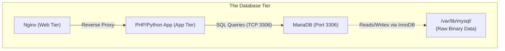
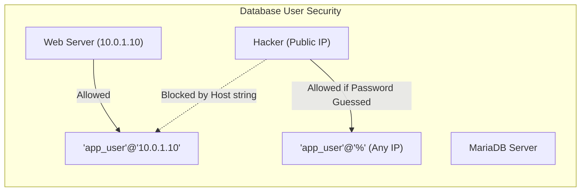
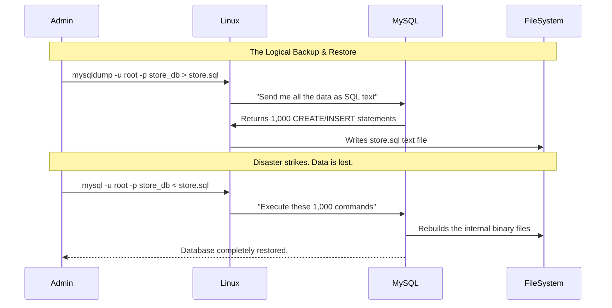

# CHAPTER 69 — MYSQL / MARIADB ADMINISTRATION

---

## 1. Introduction

### Why This Topic Exists
A web server (like Nginx) is stateless; it just serves files. An application server (like Tomcat or Python) executes logic, but it loses all its memory when you reboot it. To build an enterprise application, you need a place to permanently store the customer accounts, shopping cart data, and transaction histories. You need a **Database**. While there are many types of databases, Relational Database Management Systems (RDBMS) like **MySQL** and its open-source fork, **MariaDB**, power a massive percentage of the internet, from small WordPress blogs to massive enterprise architectures.

### Why Linux Administrators Use It
Developers write the SQL queries to insert and extract data. But developers do not install the database. Linux administrators are responsible for installing MariaDB, securing the root database account, tuning the database memory buffers so it doesn't crash the Linux server, creating the user accounts for the developers, and setting up automated backups.

### Why Companies Care About It
Data is the lifeblood of the company. If the Nginx server crashes, the company is offline for 10 minutes until it reboots; annoying, but survivable. If the MySQL database crashes and corrupts the data files on the hard drive, the company instantly loses every customer transaction, every account balance, and every password. Properly administering, securing, and backing up databases is arguably the most critical job in IT.

---

## 2. Learning Objectives

By the end of this chapter, you will be able to:
- Install and secure MariaDB/MySQL on a Linux server.
- Log into the MySQL interactive shell.
- Create databases, create users, and grant specific privileges.
- Perform basic SQL queries (`SHOW`, `USE`, `SELECT`).
- Understand the difference between the `root` Linux user and the `root` MySQL user.
- Perform a logical backup of a database using `mysqldump`.
- Restore a database from a `.sql` dump file.

---

## 3. Beginner-Friendly Explanation

Think of a massive corporate filing system:
- **The Linux Server:** The physical office building.
- **MariaDB:** The filing cabinet software. It organizes everything perfectly into drawers (Databases) and folders (Tables).
- **The DBA (Database Administrator):** The security guard. If a developer walks in and says, "Give me all the files," the DBA says, "No, I only gave you a key to the 'Marketing' drawer. You cannot read the 'HR' drawer."
- **SQL (Structured Query Language):** The language you must speak to the filing cabinet. You cannot speak English to it. You must say: `SELECT first_name FROM employees WHERE department='Marketing';`

---

## 4. Core Theory

### 4.1 MySQL vs MariaDB
In 2009, Oracle Corporation bought MySQL. Fearing that Oracle would make MySQL a closed-source, paid product, the original creator of MySQL copied the open-source code and created a "fork" named **MariaDB**. For a Linux administrator, they are 99% identical. They use the same commands, the same ports (3306), and the same configuration files (`/etc/my.cnf`). Red Hat and Debian both use MariaDB as their default, though you can still install Oracle MySQL if required.

### 4.2 The Two Roots
This is a massive point of confusion for beginners.
1. The **Linux `root` user**: Owns the Linux OS.
2. The **MySQL `root` user**: Owns the database software.
They are completely separate. The password to log into Linux as root is NOT the same as the password to log into the database as root (unless an admin configured it poorly).

### 4.3 Logical vs Physical Backups
- **Physical Backup:** Copying the raw `/var/lib/mysql` binary files using `tar` or `rsync`. **WARNING:** Doing this while the database is running will guarantee data corruption, because the database has half the data locked in RAM and half on disk.
- **Logical Backup (`mysqldump`):** The proper way to backup. It connects to the running database and exports the data as a massive text file full of raw SQL commands (`CREATE TABLE... INSERT INTO...`). You can read this file with `cat`.

---

## 5. Internal Working

### The InnoDB Storage Engine
MariaDB stores its data using an "engine". The modern default is **InnoDB**. InnoDB is ACID-compliant (Atomicity, Consistency, Isolation, Durability). This means if a bank transfers $100 from Alice to Bob, and the power cord is pulled out of the server *exactly* halfway through the transaction, InnoDB's internal transaction logs guarantee that when the server boots back up, the transaction is completely rolled back, preventing money from magically disappearing.

---

## 6. Production Architecture



---

## 7. Command-by-Command Explanation

### 7.1 `dnf install mariadb-server`
- **Purpose:** Installs the database software. (The `mariadb` package is just the client; `mariadb-server` is the actual database engine).

### 7.2 `systemctl enable --now mariadb`
- **Purpose:** Starts the database on Port 3306.

### 7.3 `mysql_secure_installation`
- **Purpose:** **CRITICAL POST-INSTALL SCRIPT.** By default, MariaDB has no root password, allows anonymous logins, and leaves a dangerous "test" database installed. This script walks you through locking down the database for production.

### 7.4 `mysql -u root -p`
- **Purpose:** Logs into the interactive SQL shell as the MySQL root user. The `-p` prompts you for the password.

### 7.5 `mysqldump -u root -p my_app > backup.sql`
- **Purpose:** Dumps the `my_app` database into a logical SQL text file.

---

## 8. Syntax Breakdown

**Creating a Database and User (Inside the `mysql>` shell)**

```sql
CREATE DATABASE webapp_db;
CREATE USER 'dev_user'@'localhost' IDENTIFIED BY 'SuperSecret123!';
GRANT ALL PRIVILEGES ON webapp_db.* TO 'dev_user'@'localhost';
FLUSH PRIVILEGES;
```
- `webapp_db.*`: Grants access to every Table (`*`) inside that specific database. (Never grant `*.*` unless the user is an absolute admin).
- `'dev_user'@'localhost'`: **CRITICAL SECURITY.** This user can ONLY log into the database if they are physically SSH'd into the database server itself (`localhost`). If a hacker tries to connect from the internet, the database forcefully rejects them, even if they have the password. (If the app server is on a different IP, you would use `'dev_user'@'10.0.1.50'`).
- `FLUSH PRIVILEGES`: Tells MariaDB to instantly reload the security tables in RAM so the new permissions take effect.

---

## 9. Parameter Explanation

| `/etc/my.cnf.d/server.cnf` Setting | Purpose |
|:---|:---|
| `bind-address = 127.0.0.1` | Security. Forces MariaDB to only listen to the local server. If your app and database are on the same machine, use this. If your app is on a separate server, you must change this to `0.0.0.0` to allow network connections. |
| `innodb_buffer_pool_size = 4G` | **The most important performance setting.** Determines how much of the database is cached in RAM instead of reading from the slow hard drive. On a dedicated database server, this is usually set to 70% of the total physical RAM. |
| `max_connections = 500` | Limits how many simultaneous users/apps can connect. If Nginx tries to send 501 users, the 501st user gets a `Too many connections` error. |

---

## 10. Sample Output Analysis

**Scenario:** We are writing a script and want to test a query without going into the interactive `mysql>` shell.
**Command:** `mysql -u root -p'password123' -e "SHOW DATABASES;"`

**Output:**
```text
+--------------------+
| Database           |
+--------------------+
| information_schema |
| mysql              |
| performance_schema |
| webapp_db          |
+--------------------+
```

**Analysis:**
- The `-e` (execute) flag allows you to pass a raw SQL command directly from the Linux Bash terminal. The database instantly executes it, prints the ASCII table, and exits back to Bash. This is heavily used in automation scripts.
- The three `_schema` and `mysql` databases are internal system databases. DO NOT delete them. `webapp_db` is the one we created.

---

## 11. Architecture Diagram


*Never use the `%` wildcard for a database user host unless absolutely necessary. Bind users to the specific IP address of the application server.*

---

## 12. Workflow Diagram



---

## 13. Real Production Examples

### Resetting a Lost Root Password
A junior admin loses the MySQL root password. You cannot log into the database. To fix it, you must bypass the security engine entirely.
1. Stop the database: `systemctl stop mariadb`
2. Start it in safe mode (skipping the password tables): `mysqld_safe --skip-grant-tables &`
3. Log in without a password: `mysql -u root`
4. Use SQL to forcefully update the password:
   `ALTER USER 'root'@'localhost' IDENTIFIED BY 'NewPassword';`
5. Flush, exit, and restart the service normally: `systemctl restart mariadb`.

### The Out of Memory (OOM) Killer
The Linux server crashes. You look in `/var/log/messages` and see `Out of memory: Killed process 1234 (mysqld)`.
Why? The administrator set `innodb_buffer_pool_size = 16G` on a server that only has 16GB of physical RAM. The Linux OS needed 1GB to run, there was no RAM left, so the Linux Kernel violently assassinated the database process to save itself. You must edit `/etc/my.cnf.d/server.cnf` and lower the buffer to `12G`.

---

## 14. Common Mistakes

1. **Skipping `mysql_secure_installation`** — If you install MariaDB and put it on the internet without running this script, automated bots will find it within 15 minutes, log in as the blank `root` user, delete your data, and leave a Bitcoin ransom note.
2. **Forgetting the Semicolon (`;`)** — Inside the `mysql>` shell, you type `SHOW DATABASES`. You hit Enter. The prompt changes to `->`. Nothing happens. You hit Enter 10 times. Still nothing. In SQL, commands DO NOT execute when you hit Enter. They execute when you type a semicolon `;`. You must type `SHOW DATABASES;`.
3. **Putting passwords in Bash History** — If you run `mysql -u root -pMySecretPassword`, that password is now permanently saved in plain text in your `~/.bash_history` file. Anyone who gains access to your Linux user account can see the database password. Always use `-p` (with no password attached) so it securely prompts you on a hidden line.

---

## 15. Best Practices

- **The Principle of Least Privilege:** A WordPress blog only needs to `SELECT`, `INSERT`, `UPDATE`, and `DELETE` data. It does NOT need permission to `DROP` (delete) an entire database, nor does it need to `GRANT` privileges to other users. Never give the application the `ALL PRIVILEGES` grant if you can avoid it.
- **Automated `.my.cnf`:** If you want a cron job to run a `mysqldump` every night, it cannot prompt you for a password. Create a hidden file in the `root` user's home directory (`/root/.my.cnf`) containing the credentials.
```ini
[client]
user=root
password=SuperSecretPassword
```
Run `chmod 600 /root/.my.cnf`. Now, the root Linux user can simply type `mysql` or `mysqldump` and it will securely read the file and log in instantly without a prompt.

---

## 16. Security Considerations

- **Network Exposure:** By default, port 3306 is open. If you have a classic 3-tier architecture (Nginx -> App -> DB), the Database server should NEVER have a Public IP address. It should sit in a Private Subnet. Even then, the Linux `firewalld` on the Database server should be configured to ONLY allow Port 3306 traffic originating from the specific internal IP address of the App server.

---

## 17. Performance Considerations

- **Query Optimization (Slow Query Log):** If a website takes 10 seconds to load, it is usually because a developer wrote a terrible SQL query that forces the database to scan 10 million rows. You can enable the "Slow Query Log" in `/etc/my.cnf.d/server.cnf`.
  `slow_query_log = 1`
  `long_query_time = 2`
  This tells MariaDB to write any query taking longer than 2 seconds to a log file. You can then hand that log file to the developers so they can fix their code.

---

## 18. Troubleshooting Guide

| Symptom | Root Cause | Resolution |
|:---|:---|:---|
| `Access denied for user 'root'@'localhost'`| Wrong password | Ensure you are typing the MySQL password, not the Linux root password. |
| `Can't connect to local MySQL server through socket` | Daemon is dead | MariaDB is not running. Check `systemctl status mariadb`. |
| `Too many connections` | Max connections hit | Edit config to increase `max_connections`, or fix the app that is leaking connections. |
| `mysqldump: Got error: 1044` | Insufficient privileges | The user running the backup does not have the `LOCK TABLES` privilege required for logical dumps. |

---

## 19. Practical Labs

**Lab 69.1:** Installation and Securing
1. `sudo dnf install mariadb-server -y`
2. `sudo systemctl enable --now mariadb`
3. `sudo mysql_secure_installation`
   - Press Enter for current root password (it is blank).
   - Switch to unix_socket authentication? N
   - Change the root password? Y (Set a strong password).
   - Remove anonymous users? Y
   - Disallow root login remotely? Y
   - Remove test database? Y
   - Reload privilege tables? Y

**Lab 69.2:** Creating a Database and User
1. Log in: `mysql -u root -p`
2. Run SQL:
   ```sql
   CREATE DATABASE testdb;
   CREATE USER 'testuser'@'localhost' IDENTIFIED BY 'password123';
   GRANT ALL PRIVILEGES ON testdb.* TO 'testuser'@'localhost';
   FLUSH PRIVILEGES;
   SHOW DATABASES;
   EXIT;
   ```
3. Verify the new user: `mysql -u testuser -p` (Use 'password123').
4. Type `SHOW DATABASES;`. You will notice `testuser` can ONLY see `testdb` and `information_schema`. They are safely locked out of the rest of the system.

---

## 20. Mini Project

The Backup and Restore Drill.
1. Log into your `testuser` account: `mysql -u testuser -p testdb`
2. Create some data:
   `CREATE TABLE cars (brand VARCHAR(50));`
   `INSERT INTO cars VALUES ('Toyota'), ('Ford');`
   `EXIT;`
3. Perform the Logical Backup:
   `mysqldump -u root -p testdb > /tmp/testdb_backup.sql`
4. Destroy the database (Disaster simulation!):
   `mysql -u root -p -e "DROP DATABASE testdb; CREATE DATABASE testdb;"`
5. Restore from the backup:
   `mysql -u root -p testdb < /tmp/testdb_backup.sql`
6. Verify the restore:
   `mysql -u testuser -p testdb -e "SELECT * FROM cars;"`

---

## 21. Assignments

1. What is the fundamental difference between the Linux `root` user and the MariaDB `root` user?
2. Why is backing up the raw `/var/lib/mysql` directory with `tar` while the database is running considered extremely dangerous?
3. What is the purpose of the `/root/.my.cnf` file?

---

## 22. Interview Questions

### Basic
1. **Q: What command-line tool is used to export a MySQL database into a logical SQL text file for backups?**
   A: `mysqldump`

2. **Q: You type `SHOW DATABASES` inside the MySQL shell and hit Enter. Nothing happens. Why?**
   A: Because all SQL statements must be terminated with a semicolon (`;`).

### Intermediate
3. **Q: You want to grant a web application access to a database. You run: `GRANT ALL PRIVILEGES ON webapp.* TO 'webuser'@'%'`. A senior engineer reviews your code and tells you to delete it immediately because it is a massive security risk. Why?**
   A: The `%` symbol is the wildcard for the host. It means `webuser` is allowed to authenticate to the database from ANY IP address on the entire internet. This bypasses the first layer of network defense. The user should be strictly bound to the specific internal IP address of the web server (e.g., `'webuser'@'10.0.1.50'`).

4. **Q: An application is running slowly. The Linux server has 32GB of RAM. You check `top` and notice the MySQL process is only using 128MB of RAM, while the CPU is experiencing heavy "I/O Wait" (waiting for the hard drive). How do you tune the database to fix this?**
   A: MariaDB defaults to a very small memory footprint. I need to edit the configuration file and increase the `innodb_buffer_pool_size`. By setting it to roughly 70% of the system RAM (e.g., `22G`), MariaDB will load the database into the blazing-fast RAM, completely eliminating the hard drive bottleneck.

### Scenario-Based
5. **Q: A developer comes to you in a panic. They accidentally ran `DELETE FROM users;` and wiped the entire production table. You have a `mysqldump` backup from 3:00 AM last night. The database is 100GB. You only need to restore the `users` table. If you run `mysql < backup.sql`, it will overwrite the entire 100GB database, taking hours and destroying all the good data added today. How do you recover *just* the users table from the monolithic 100GB SQL file?**
   A: A `mysqldump` file is just plain text. I can use standard Linux text processing tools to extract the specific table. I would use `awk` or `sed` to parse the 100GB `backup.sql` file, searching for the string `CREATE TABLE users`, and extracting all the text between that and the next `CREATE TABLE` statement into a new, smaller file named `users_only.sql`. I would then import that small file into the database, restoring the table in seconds without impacting the rest of the database. (Alternatively, extract the whole SQL file into a temporary test database, and copy the table over).

---

## 23. Chapter Summary and Quick Revision Notes

- **MariaDB/MySQL:** Industry-standard Relational Databases.
- **Port:** TCP 3306.
- **`mysql_secure_installation`:** Mandatory script to lock down a new installation.
- **`mysql`:** The command to log in and query the database.
- **`mysqldump`:** The command to backup the database to a `.sql` text file.
- **Security:** Never use `%` for users. Always bind to `localhost` or specific IPs.
- **Tuning:** `innodb_buffer_pool_size` is the #1 setting to increase performance (more RAM usage).
- **The Semicolon:** SQL statements require a `;` to execute.

---

## 24. Cheat Sheet

| Command | Purpose |
|:---|:---|
| `mysql -u root -p` | Log in interactively |
| `mysql -u root -p -e "QUERY;"` | Run query from bash |
| `mysqldump -u root -p db > db.sql` | Backup a database |
| `mysql -u root -p db < db.sql` | Restore a database |
| `CREATE DATABASE db;` | SQL: Create DB |
| `CREATE USER 'u'@'ip' IDENTIFIED BY 'p';`| SQL: Create User |
| `GRANT ALL PRIVILEGES ON db.* TO 'u'@'ip';` | SQL: Grant access |
| `FLUSH PRIVILEGES;` | SQL: Reload security rules |
