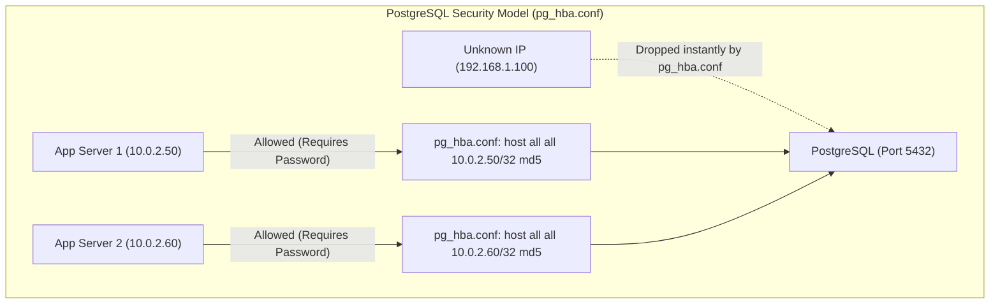
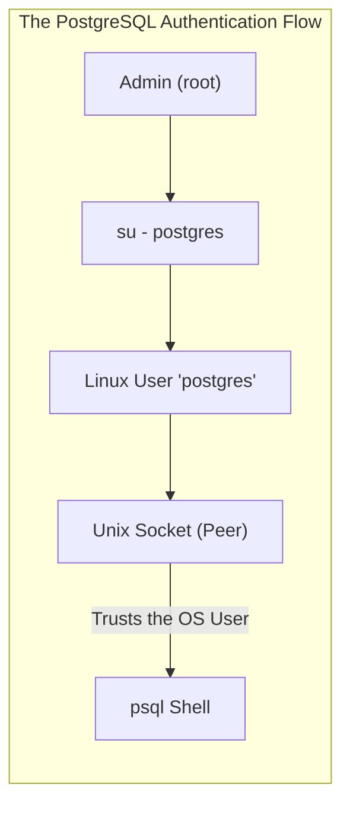

# CHAPTER 70 — POSTGRESQL ADMINISTRATION

---

## 1. Introduction

### Why This Topic Exists
While MySQL/MariaDB is the most *popular* database in the world, **PostgreSQL** (often just called Postgres) is widely considered the most *advanced* open-source relational database in the world. Originally developed at UC Berkeley, Postgres was designed for absolute data integrity, complex mathematical computations, and massive concurrency. If a startup is building a simple blog, they use MySQL. If a massive financial institution is building a global trading platform, they use PostgreSQL.

### Why Linux Administrators Use It
Administering PostgreSQL on Linux is entirely different from administering MySQL. The configuration files are different, the user authentication model (`pg_hba.conf`) is radically different, and the command-line tools (`psql`, `pg_dump`) have a completely different syntax. Administrators must know both platforms to survive in a modern enterprise environment.

### Why Companies Care About It
Features and Compliance. PostgreSQL supports advanced data types (like native JSON processing and Geographic Information Systems via PostGIS) that MySQL historically struggled with. Furthermore, its strict adherence to SQL standards and powerful concurrent processing capabilities make it the database of choice for complex data warehousing and analytical applications.

---

## 2. Learning Objectives

By the end of this chapter, you will be able to:
- Install and start PostgreSQL on a Linux server.
- Understand the `postgres` system user and `ident`/`peer` authentication.
- Log into the interactive `psql` shell.
- Configure network access and password authentication using `pg_hba.conf`.
- Perform basic administration (creating users and databases).
- Backup and restore databases using `pg_dump` and `psql`.

---

## 3. Beginner-Friendly Explanation

Think of two different car engines:
- **MySQL:** A highly tuned street racing engine. It is incredibly fast, easy to maintain, and perfect for getting from Point A to Point B on a paved road (standard web applications).
- **PostgreSQL:** The engine of a massive freight train. It is slightly more complex to start and operate, but it is capable of pulling 100 heavily loaded train cars over a mountain without breaking a sweat (complex, massive data processing).

---

## 4. Core Theory

### 4.1 The `postgres` System User
In MySQL, you just type `mysql -u root -p`. PostgreSQL does NOT do this. 
When you install Postgres, it creates a Linux user named `postgres`. By default, the database is configured to use **Peer Authentication**. This means the database trusts the Linux OS. If you are logged into the Linux OS as the user `postgres`, the database assumes you are the Database Administrator and lets you right in without asking for a password. You CANNOT log into the database as the `root` Linux user.

### 4.2 Configuration Files
Unlike MySQL which keeps everything in `/etc/my.cnf`, Postgres relies on two critical files (usually located in `/var/lib/pgsql/data/` on RHEL, or `/etc/postgresql/14/main/` on Ubuntu):
1. **`postgresql.conf`:** The main engine settings (Memory, Ports, Logging).
2. **`pg_hba.conf`:** Host-Based Authentication. This file strictly controls exactly *who* can connect, from *where*, and *how* they must authenticate.

### 4.3 `psql` Shell Meta-Commands
Inside the MySQL shell, you type `SHOW DATABASES;`. Postgres does not recognize standard "SHOW" commands for administration. Instead, it uses "Meta-Commands" that start with a backslash `\`.
- `\l` : List databases
- `\du`: List users (roles)
- `\c dbname`: Connect to a specific database

---

## 5. Internal Working

### MVCC (Multi-Version Concurrency Control)
PostgreSQL handles multiple users editing data simultaneously using MVCC. If User A is updating a massive table, and User B wants to read that table at the same time, Postgres does not lock the table and force User B to wait (which is a common performance bottleneck in older databases). Instead, Postgres keeps multiple "versions" of the data in RAM. User B reads a snapshot of the old data while User A seamlessly writes the new data. This allows for massive, lock-free performance in high-traffic applications.

---

## 6. Production Architecture



---

## 7. Command-by-Command Explanation

### 7.1 `dnf install postgresql-server`
- **Purpose:** Installs the database engine.

### 7.2 `postgresql-setup --initdb`
- **Purpose:** **CRITICAL FOR RED HAT / ROCKY.** Unlike MySQL, Postgres does not automatically create its internal data files when you install the package. You MUST run the `initdb` command to physically create the database structure in `/var/lib/pgsql/data/` before you can start the service. (Ubuntu/Debian usually automates this step).

### 7.3 `systemctl enable --now postgresql`
- **Purpose:** Starts the database on Port 5432.

### 7.4 `sudo -i -u postgres`
- **Purpose:** You cannot log into Postgres as `root`. You must switch your Linux user to the `postgres` user. (The `-i` simulates a full login, changing your home directory and paths).

### 7.5 `psql`
- **Purpose:** Once you are the `postgres` Linux user, this command logs you into the interactive database shell.

---

## 8. Syntax Breakdown

**Configuring Host-Based Authentication (`pg_hba.conf`)**

By default, Postgres only allows local connections. To allow a web server to connect over the network, you must add a rule to `pg_hba.conf`:

```text
# TYPE  DATABASE        USER            ADDRESS                 METHOD
host    all             all             10.0.1.50/32            scram-sha-256
│       │               │               │                       │
│       │               │               │                       └── Require a password (encrypted)
│       │               │               └── The specific IP address of the Web Server
│       │               └── Which database user can connect (all)
│       └── Which database they can access (all)
└── A network TCP connection (as opposed to 'local' socket)
```
*(After editing this file, you must reload the service: `systemctl reload postgresql`).*

---

## 9. Parameter Explanation

| Postgres Meta-Command | MySQL Equivalent | Description |
|:---|:---|:---|
| `\l` | `SHOW DATABASES;` | Lists all databases. |
| `\c dbname` | `USE dbname;` | Connects (switches) to a specific database. |
| `\dt` | `SHOW TABLES;` | Displays tables in the current database. |
| `\du` | `SELECT user FROM mysql.user;` | Displays database roles (users) and their privileges. |
| `\q` | `exit;` | Quits the psql shell. |

---

## 10. Sample Output Analysis

**Scenario:** We want to create a database and a user.
**Command:** Run inside the `psql` shell as the `postgres` user:

```sql
postgres=# CREATE DATABASE crm_db;
CREATE DATABASE
postgres=# CREATE USER crm_user WITH ENCRYPTED PASSWORD 'StrongPass123!';
CREATE ROLE
postgres=# GRANT ALL PRIVILEGES ON DATABASE crm_db TO crm_user;
GRANT
```

**Analysis:**
- In Postgres, a "User" is actually just a "Role" that has the `LOGIN` privilege. This is why the output says `CREATE ROLE` even though you typed `CREATE USER`.
- You MUST put single quotes around the password.
- Unlike MySQL, Postgres does not require you to run `FLUSH PRIVILEGES` after simple GRANT commands. The changes take effect immediately.

---

## 11. Architecture Diagram


*This design prevents hackers from bruteforcing the database root password over the network, because the root user relies on Linux OS authentication, not a database password.*

---

## 12. Workflow Diagram

```mermaid
sequenceDiagram
    participant Admin
    participant pg_dump
    participant TargetServer
    participant psql

    Note over Admin,psql: The PostgreSQL Backup & Restore
    Admin->>pg_dump: pg_dump -U postgres crm_db > crm_backup.sql
    pg_dump-->>Admin: Generates logical SQL file.
    Note right of Admin: Moves file to TargetServer
    Admin->>psql: psql -U postgres (Log in to shell)
    psql->>TargetServer: CREATE DATABASE crm_db; \q
    Admin->>psql: psql -U postgres -d crm_db < crm_backup.sql
    psql-->>Admin: Rebuilds tables and data into new DB.
```

---

## 13. Real Production Examples

### The Listen Address Trap
You install Postgres and configure `pg_hba.conf` perfectly to allow the web server to connect. The web server still times out.
By default, Postgres only listens on `localhost` (127.0.0.1) for security. It physically will not accept network packets.
You must edit `/var/lib/pgsql/data/postgresql.conf`:
Change `#listen_addresses = 'localhost'` to `listen_addresses = '*'`.
Restart the database. Postgres is now bound to all network interfaces and will accept connections on Port 5432.

### Standalone User Creation
Instead of logging into the `psql` shell to run `CREATE USER` commands, Postgres provides standalone Linux commands that you can use in bash scripts.
While logged in as the `postgres` Linux user:
```bash
createuser --pwprompt new_developer
createdb -O new_developer dev_database
```
*(`-O` makes the new user the permanent Owner of the database).*

---

## 14. Common Mistakes

1. **Trying to run `psql` as root** — You type `psql` as the root user. It says `psql: FATAL: role "root" does not exist`. Beginners get frustrated. Remember: You MUST switch to the `postgres` Linux user first (`su - postgres`).
2. **Forgetting to create the target database on restore** — In MySQL, a `.sql` dump file often contains the `CREATE DATABASE` command. In Postgres, a standard `pg_dump` ONLY contains the tables and the data. If you try to restore it (`psql < dump.sql`), it will fail. You must manually run `createdb dbname` first, and then restore the data INTO that empty database (`psql -d dbname < dump.sql`).
3. **Ignoring `pg_hba.conf` order** — The `pg_hba.conf` file is read from top to bottom. If Line 10 says "Deny everyone", and Line 11 says "Allow the web server", the web server will be denied because the rule on Line 10 triggered first. Always put specific Allow rules at the top.

---

## 15. Best Practices

- **The `postgres` Password:** Even though you authenticate using Peer (OS) authentication locally, you should set a password for the `postgres` database user just in case you need to connect to it via GUI tools (like pgAdmin or DBeaver) over the network. Inside the `psql` shell, run: `\password postgres` to set it securely.
- **Vacuuming:** When you run an `UPDATE` or `DELETE` in Postgres (due to MVCC), Postgres doesn't actually delete the old data immediately; it just hides it. Over time, the database becomes bloated with "dead tuples," consuming massive disk space and slowing down queries. Postgres runs an "autovacuum" daemon in the background to clean this up, but on heavily trafficked enterprise databases, administrators often have to manually schedule intense `VACUUM FULL` commands during maintenance windows to reclaim disk space.

---

## 16. Security Considerations

- **`scram-sha-256` vs `md5`:** Historically, `pg_hba.conf` used `md5` to encrypt passwords over the wire. MD5 is an ancient, cryptographically broken algorithm. Modern Postgres uses `scram-sha-256`. When configuring `pg_hba.conf`, ensure you specify `scram-sha-256` in the `METHOD` column to prevent hackers from capturing and cracking database passwords traversing the network.

---

## 17. Performance Considerations

- **Shared Buffers:** The Postgres equivalent to MySQL's `innodb_buffer_pool_size` is `shared_buffers`. This determines how much RAM Postgres uses for caching data. In `/var/lib/pgsql/data/postgresql.conf`, the default is a tiny 128MB. On a dedicated database server, this should be increased to roughly 25% of the total system RAM (e.g., `shared_buffers = 4GB`). Do NOT set it to 70% like MySQL; Postgres relies heavily on the underlying Linux OS page cache for performance, so the OS needs to retain the majority of the RAM.

---

## 18. Troubleshooting Guide

| Symptom | Root Cause | Resolution |
|:---|:---|:---|
| `psql: FATAL: Ident authentication failed` | `pg_hba.conf` misconfig | The client is trying to connect locally but doesn't match the required OS user. Check the local/peer rules in `pg_hba.conf`. |
| Connection refused over network | Not listening on IP | Edit `postgresql.conf` and set `listen_addresses = '*'`. Restart service. |
| Connection times out over network| Firewall blocking | Run `firewall-cmd --add-port=5432/tcp --permanent && firewall-cmd --reload`. |
| `createdb: command not found` | Not logged in as postgres | Exit your root shell and run `su - postgres`. |

---

## 19. Practical Labs

**Lab 70.1:** Installation and Initialization (RHEL/Rocky)
1. `sudo dnf install postgresql-server -y`
2. **Crucial Step:** `sudo postgresql-setup --initdb`
3. `sudo systemctl enable --now postgresql`
4. Switch user: `sudo -i -u postgres`
5. Access the shell: `psql`
6. Create a user: `CREATE USER alice WITH ENCRYPTED PASSWORD 'secret';`
7. Type `\du` to verify Alice was created.
8. Type `\q` to exit the shell.

**Lab 70.2:** Logical Backup
1. (Still as the `postgres` user). Create a test database: `createdb test_backup`
2. Dump it to a file: `pg_dump test_backup > /tmp/backup.sql`
3. Destroy the database: `dropdb test_backup`
4. Recreate it empty: `createdb test_backup`
5. Restore the file: `psql -d test_backup < /tmp/backup.sql`

---

## 20. Mini Project

Enabling Network Access.
Your developer is on IP `192.168.1.50` and wants to connect to your Postgres server using DBeaver (a GUI tool) on Port 5432.
1. `sudo vim /var/lib/pgsql/data/postgresql.conf`
   - Find `#listen_addresses = 'localhost'`
   - Change to `listen_addresses = '*'`
2. `sudo vim /var/lib/pgsql/data/pg_hba.conf`
   - Scroll to the very bottom.
   - Add: `host    all    all    192.168.1.50/32    scram-sha-256`
3. `sudo firewall-cmd --add-port=5432/tcp --permanent && sudo firewall-cmd --reload`
4. `sudo systemctl restart postgresql`
The developer can now successfully connect!

---

## 21. Assignments

1. What is the difference in how you log into MySQL locally vs how you log into PostgreSQL locally?
2. Which configuration file dictates exactly which IP addresses are allowed to connect to PostgreSQL?
3. In PostgreSQL, what is the purpose of the `shared_buffers` parameter, and what is the recommended percentage of RAM it should be set to?

---

## 22. Interview Questions

### Basic
1. **Q: What is the default TCP port for PostgreSQL?**
   A: 5432.

2. **Q: Inside the `psql` shell, what meta-command do you use to list all databases?**
   A: `\l` (backslash L).

### Intermediate
3. **Q: You install PostgreSQL on a RHEL server. You run `systemctl start postgresql`, but the service instantly fails. You check the logs, and it complains that the data directory is missing. What critical installation step did you forget?**
   A: I forgot to initialize the database cluster. On RHEL-based systems, installing the RPM package does not create the binary data structure. I must run `postgresql-setup --initdb` before the service can be started.

4. **Q: You have a database named `sales_db`. You want to export a logical backup of this database into a text file. Write the command assuming you are logged in as the `postgres` Linux user.**
   A: `pg_dump sales_db > sales_backup.sql`

### Scenario-Based
5. **Q: A new application server (10.0.5.100) is deployed. You are asked to grant it access to the PostgreSQL database. You create the database user. You edit `pg_hba.conf` and add `host all all 10.0.5.100/32 scram-sha-256`. You run `systemctl reload postgresql`. The application server still gets a "Connection Refused" error. You check the Linux firewall, and Port 5432 is definitely open. What config file did you forget to edit?**
   A: I forgot to edit `postgresql.conf`. By default, PostgreSQL has `listen_addresses = 'localhost'`, meaning the database engine physically will not accept packets from the network interface card, regardless of what the firewall or `pg_hba.conf` says. I must change it to `listen_addresses = '*'` and perform a full `systemctl restart postgresql`.

---

## 23. Chapter Summary and Quick Revision Notes

- **PostgreSQL:** An advanced, highly compliant, object-relational database.
- **Port:** TCP 5432.
- **`postgres` User:** The default Linux OS user and Database Superuser. You must `su - postgres` to administer the DB locally.
- **`initdb`:** Required on RHEL to generate the database data files post-installation.
- **`psql`:** The interactive shell. Uses `\` meta-commands instead of `SHOW`.
- **`pg_hba.conf`:** Host-Based Authentication. Controls exactly who can connect over the network.
- **`postgresql.conf`:** The main engine config (`listen_addresses`, `shared_buffers`).
- **`pg_dump`:** The logical backup tool.

---

## 24. Cheat Sheet

| Command / Syntax | Purpose |
|:---|:---|
| `su - postgres` | Switch to the Postgres Linux user |
| `psql` | Open the interactive shell |
| `\l` | List databases |
| `\c dbname` | Connect to a database |
| `\du` | List users (roles) |
| `\q` | Quit shell |
| `pg_dump db_name > out.sql` | Backup a database |
| `psql -d db_name < out.sql` | Restore a database |
| `listen_addresses = '*'` | Bind DB to public network |
