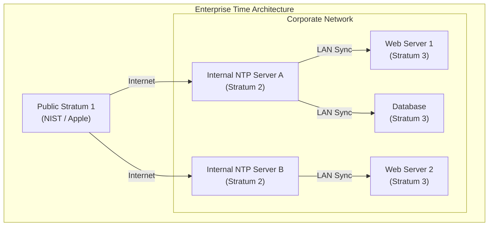
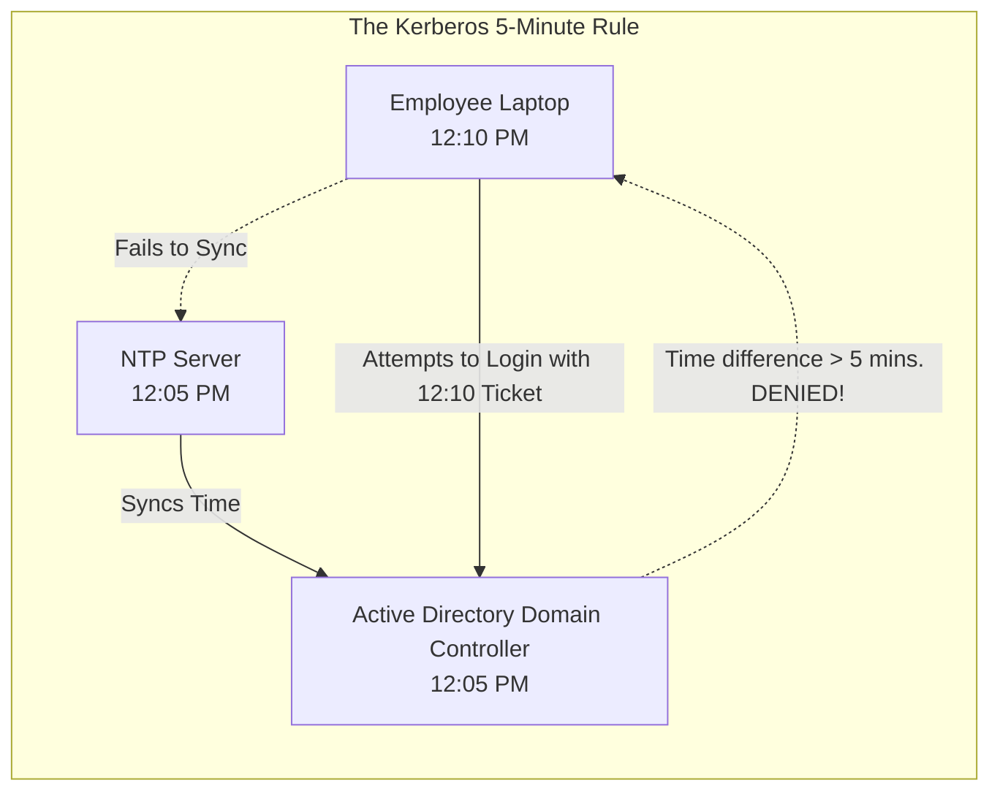
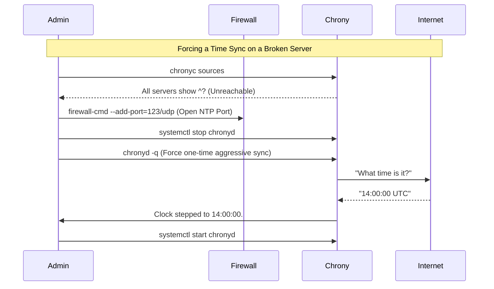

# CHAPTER 71 — CHRONY AND NETWORK TIME PROTOCOL (NTP)

---

## 1. Introduction

### Why This Topic Exists
A computer's internal hardware clock is just a vibrating quartz crystal. Over the course of a month, physical factors (like temperature) cause the crystal to vibrate slightly faster or slower, resulting in "Clock Drift". A server's clock might drift by 3 seconds a month. In a personal laptop, this doesn't matter. In a distributed enterprise Linux cluster, a 3-second difference between two servers will cause cryptographic certificates to fail, database transactions to overwrite each other, and clustered filesystems to violently crash. **NTP (Network Time Protocol)** exists to ensure every server on the planet agrees on the exact same millisecond.

### Why Linux Administrators Use It
Linux administrators configure NTP (using modern daemons like **Chrony**) to synchronize their servers with highly accurate atomic clocks owned by governments and universities. They also build internal NTP servers so that if the corporate network is disconnected from the public internet, the 10,000 internal servers still perfectly agree with each other.

### Why Companies Care About It
Security and Data Integrity. 
- **Security:** Kerberos (the authentication protocol used by Microsoft Active Directory) has a strict 5-minute rule. If a Linux server tries to authenticate a user, but its clock is 5 minutes and 1 second faster than the Domain Controller, the authentication is instantly rejected. No one can log in.
- **Data Integrity:** If a financial trade happens at 12:00:01 on Server A, and a withdrawal happens at 12:00:02 on Server B, the database must know exactly which one happened first. If Server B's clock is drifting, the database corrupts the financial history.

---

## 2. Learning Objectives

By the end of this chapter, you will be able to:
- Explain the concept of Clock Drift and NTP Strata.
- Understand the difference between the legacy `ntpd` and modern `chronyd`.
- Configure Chrony to synchronize time with public internet pools.
- Use `chronyc` to verify synchronization and troubleshoot time offsets.
- Force a manual time sync using `chronyd -q`.
- Set the correct Timezone using `timedatectl`.

---

## 3. Beginner-Friendly Explanation

Think of a massive orchestra:
- **The Hardware Clock:** Every musician (Server) has a metronome ticking in their head. Because everyone's brain is different, some tick slightly faster, some slower. If they play for an hour, the song sounds like chaos.
- **NTP (Network Time Protocol):** The Conductor. The Conductor has an atomic stopwatch. The Conductor waves a baton.
- **Chrony:** The musician's eyes. The musician looks at the Conductor. If the musician realizes they are playing slightly too fast, they don't abruptly stop (which would ruin the song). They gracefully slow down their tempo until they perfectly match the Conductor's baton.

---

## 4. Core Theory

### 4.1 The Stratum Hierarchy
NTP operates on a tiered system called "Strata" to prevent a million servers from all trying to talk to the same atomic clock at once.
- **Stratum 0:** The actual atomic clock or GPS satellite (Hardware).
- **Stratum 1:** A government/university server physically wired to a Stratum 0 clock.
- **Stratum 2:** A server that syncs its time from a Stratum 1 server. (This is what most public internet time pools are).
- **Stratum 3:** A standard corporate Linux server that syncs from a Stratum 2 server.
*The higher the number, the further away from the atomic source.*

### 4.2 `ntpd` vs `chronyd`
For 20 years, Linux used the `ntpd` daemon. It was designed for servers with permanent, perfect internet connections. If a server was disconnected from the internet for a few hours, `ntpd` would panic and struggle to fix the time.
**Chrony (`chronyd`)** is the modern replacement (default in RHEL 8/9 and modern Ubuntu). It was designed specifically for modern networks, laptops that go to sleep, and virtual machines that get paused. Chrony can calculate exactly how badly a clock drifted while the server was asleep, and fix it instantly upon waking up.

### 4.3 Stepping vs Slewing
If a server's clock is 5 minutes behind the real time, how does the NTP daemon fix it?
- **Stepping:** It instantly jumps the clock forward 5 minutes. **DANGEROUS.** If a backup script is scheduled to run at 2:03 AM, and the clock jumps from 2:00 AM to 2:05 AM, the backup script *never runs*.
- **Slewing:** It makes a mathematical adjustment so that 1 real-world second takes 0.9 server seconds. The server's clock "runs fast" for a few hours until it gracefully catches up to the real time, without ever skipping a minute. (This is the default and safe behavior).

---

## 5. Internal Working

### Real-Time Clock (RTC) vs System Clock
A server actually has two clocks.
1. **RTC (Hardware Clock):** A tiny chip on the motherboard powered by a watch battery. It keeps time when the server is completely unplugged from the wall.
2. **System Clock (Kernel):** When Linux boots, it asks the RTC what time it is, and then the Linux Kernel maintains its own software clock.
Chrony primarily adjusts the System Clock, but occasionally it pushes the correct time down into the RTC motherboard chip so that if the server loses power, it boots back up with the correct time.

---

## 6. Production Architecture


*Enterprise servers do NOT talk to the internet to get time. They sync from two internal corporate NTP servers, ensuring that even if the internet goes down, all internal servers drift together at the exact same rate.*

---

## 7. Command-by-Command Explanation

### 7.1 `timedatectl set-timezone America/New_York`
- **Purpose:** NTP does not care about Timezones; it only speaks UTC (Coordinated Universal Time). The Linux OS uses the Timezone setting to translate UTC into a human-readable format. This command sets the server to Eastern Time.

### 7.2 `dnf install chrony`
- **Purpose:** Installs the modern NTP daemon.

### 7.3 `systemctl enable --now chronyd`
- **Purpose:** Starts the daemon. Note the "d" at the end (`chronyd` is the daemon, `chronyc` is the client/command-line tool).

### 7.4 `chronyc sources -v`
- **Purpose:** **CRITICAL COMMAND.** Tells you exactly which external servers Chrony is talking to, and whether or not the synchronization is currently successful.

---

## 8. Syntax Breakdown

**Configuring Chrony (`/etc/chrony.conf`)**

```text
# Use public servers from the pool.ntp.org project.
pool 2.rhel.pool.ntp.org iburst
│    │                   │
│    │                   └── Sends 4 rapid packets on startup to get the time instantly, instead of waiting 5 minutes.
│    └── The DNS address of a cluster of Stratum 2 time servers.
└── Keyword telling chrony this is a cluster, not a single IP address.

# Allow stepping ONLY during the first 3 clock updates
makestep 1.0 3
```
- `makestep 1.0 3`: As discussed, "Stepping" (jumping the clock) is dangerous for running applications. This configuration tells Chrony: "If the server is more than 1.0 seconds off, you are allowed to Step the clock, BUT ONLY during the first 3 times you check the time after booting up." This guarantees the clock is instantly fixed when the server boots, but guarantees it will safely "Slew" (adjust slowly) once applications start running.

---

## 9. Parameter Explanation

| `chronyc sources` Symbol | Meaning |
|:---|:---|
| `^*` | The Star! This is the server Chrony is currently perfectly synced to. |
| `^+` | An excellent candidate server that Chrony is keeping on standby. |
| `^?` | Unreachable. Chrony sent a packet but the server did not respond (usually a firewall issue). |
| `^x` | False ticker. The server responded, but its time is so wildly different from the others that Chrony suspects it is broken and is ignoring it. |

---

## 10. Sample Output Analysis

**Scenario:** We want to verify our server's time synchronization is healthy.
**Command:** `chronyc sources`

**Output:**
```text
MS Name/IP address         Stratum Poll Reach LastRx Last sample
===============================================================================
^+ time1.google.com              1   6    37    12   -125us[ -125us] +/-   15ms
^* time2.google.com              1   6   377    14   +452ns[+1124ns] +/-   11ms
^? 10.0.5.50                     0   6     0     -     +0ns[   +0ns] +/-    0ns
```

**Analysis:**
- **`time2.google.com`:** Has the `^*` (Star). We are perfectly synced to it. It is a Stratum 1 atomic clock.
- **`Reach 377`:** 377 is an octal number representing the last 8 network packets. If it says 377, it means the last 8 packets were 100% successful. The network is perfect.
- **`Last sample`:** We are roughly `+452ns` (nanoseconds) away from perfect atomic time. This is incredibly accurate.
- **`10.0.5.50`:** Has a `^?`. Reach is `0`. We tried to connect to an internal server, but the network failed. A firewall is likely blocking UDP Port 123.

---

## 11. Architecture Diagram


*If a company's computers are not universally bound to NTP, employees will randomly be unable to log into their machines, and administrators will waste hours resetting passwords when the real issue is just a drifting clock.*

---

## 12. Workflow Diagram



---

## 13. Real Production Examples

### The Leap Second Crash
Every few years, the rotation of the Earth slows down slightly, and scientists add a "Leap Second" to the atomic clocks (e.g., 23:59:60).
In 2012, massive sections of the internet (including Reddit and Mozilla) violently crashed. Their Linux servers received the "Leap Second" packet from NTP, didn't know how to handle a 60th second, and the Linux kernel panicked and froze.
Modern `chronyd` handles this gracefully by default. Instead of actually telling the Linux kernel it is 23:59:60, `chronyd` intercepts the leap second and artificially "Slews" (slows down) the server clock for a few hours until the extra second is absorbed, preventing kernel panics.

### Building an Internal NTP Server
If you want a specific Linux server (`10.0.1.10`) to act as the Master Conductor for all other servers in your private network:
1. Edit `/etc/chrony.conf` on `10.0.1.10`.
2. Add: `allow 10.0.1.0/24`. (This tells Chrony it is allowed to *serve* time to other machines in that subnet, acting like a Stratum 2 server).
3. Restart `chronyd`.
4. On all other servers, edit their `chrony.conf` and point them to `server 10.0.1.10 iburst`.

---

## 14. Common Mistakes

1. **Blocking UDP 123** — NTP uses UDP Port 123. It does NOT use TCP. If a junior administrator adds a firewall rule allowing TCP 123, the time synchronization will silently fail, the clocks will drift, and the application will eventually crash weeks later.
2. **Double NTP Daemons** — If you install a specialized database cluster (like Ceph or Cassandra), the database might try to install its own time-sync daemon. If both `chronyd` and `ntpd` (or `systemd-timesyncd`) are running simultaneously, they will fight over the kernel's clock, making it jump forward and backward violently, destroying the database. Ensure ONLY `chronyd` is enabled.
3. **Misunderstanding UTC** — An admin in New York looks at the database logs. A transaction happened at 14:00 (2:00 PM). The admin checks the server clock. It says 10:00 AM. The admin panics, thinking the clock is broken. The clock is fine. Servers log in UTC by default. 14:00 UTC *is* 10:00 AM New York time. Administrators must train themselves to translate UTC in their heads.

---

## 15. Best Practices

- **Hardware Clock Sync:** By default, Linux occasionally writes the software time to the hardware clock (RTC). However, in strict environments, administrators add `rtcsync` to `/etc/chrony.conf` to explicitly force this behavior, ensuring the server boots with near-perfect time even before the network card activates.
- **Virtual Machines (VMware/Hyper-V):** Virtual Machines do not have a physical quartz crystal. They have a fake, virtualized clock provided by the Hypervisor. Virtual clocks drift *wildly*. You should configure your Hypervisor (VMware Tools) to NOT synchronize time to the VM, and instead, run `chronyd` directly inside the Linux VM for absolute accuracy.

---

## 16. Security Considerations

- **NTP Amplification Attacks:** Historically, hackers used public NTP servers to launch massive DDoS attacks. They would send a tiny 1-byte packet to an NTP server, but spoof the return IP address to point to their victim. The NTP server would respond with a 500-byte diagnostic response and blast it at the victim. If the hacker did this 1 million times, the victim's network was crushed. Modern `chrony.conf` is secure by default because it restricts access. Only add the `allow` directive if you explicitly intend to act as a server.

---

## 17. Performance Considerations

- **The `iburst` flag:** Always append the `iburst` keyword to your server pools in `chrony.conf`. Without it, if a server reboots, the NTP daemon will slowly send 1 packet every 64 seconds. It might take 5 minutes before it trusts the time enough to adjust the clock. `iburst` sends 4 packets in 2 seconds, achieving instant synchronization on boot.

---

## 18. Troubleshooting Guide

| Symptom | Root Cause | Resolution |
|:---|:---|:---|
| `chronyc sources` shows `^?` | Network Blocked | Open UDP 123 Outbound on the corporate firewall. |
| Time is correct, but log timestamps are 4 hours off | Wrong Timezone | Run `timedatectl set-timezone America/New_York` (or your local zone). |
| Clock is 5 years behind and won't sync | Out of Bounds | Chrony refuses to jump 5 years. Stop Chrony, run `chronyd -q` to force a jump, then restart it. |
| Cannot start chronyd | Port 123 in use | Another daemon (like `ntpd` or `systemd-timesyncd`) is already running. Stop and disable it. |

---

## 19. Practical Labs

**Lab 71.1:** Verifying Synchronization
1. Install it: `sudo dnf install chrony -y`
2. Start it: `sudo systemctl enable --now chronyd`
3. Check the status: `chronyc tracking` (This shows your exact offset from atomic time in milliseconds).
4. Check the sources: `chronyc sources -v`
5. Look for the `^*` star symbol. If you have it, you are synced.

**Lab 71.2:** Forcing a Massive Sync
1. Turn off Chrony: `sudo systemctl stop chronyd`
2. Intentionally break your clock (Set it back 1 hour):
   `sudo date -s "1 hour ago"`
3. Verify your clock is wrong: `date`
4. Use Chrony to aggressively fetch the time and fix it instantly:
   `sudo chronyd -q`
5. Verify the clock is perfect again: `date`
6. Turn Chrony back on: `sudo systemctl start chronyd`

---

## 20. Mini Project

The Corporate Time Server.
Configure your local Linux VM to serve time to other devices on your home/corporate network.
1. `sudo vim /etc/chrony.conf`
2. Add the line: `allow 192.168.1.0/24` (Replace with your actual subnet).
3. `sudo systemctl restart chronyd`
4. `sudo firewall-cmd --add-service=ntp --permanent && sudo firewall-cmd --reload`
5. If you have a second Linux VM on the same network, edit its `/etc/chrony.conf`, delete all the pool lines, and add:
   `server <IP_of_VM1> iburst`
6. Restart Chrony on VM2, run `chronyc sources`, and watch it perfectly synchronize with VM1!

---

## 21. Assignments

1. What is the difference between Stepping and Slewing a clock?
2. What does a Stratum 2 NTP server mean?
3. Which command-line tool is used to display a detailed list of the atomic clocks your server is currently communicating with?

---

## 22. Interview Questions

### Basic
1. **Q: What is the primary purpose of the Network Time Protocol (NTP)?**
   A: To perfectly synchronize computer clocks across a network, ensuring timestamps for logs, databases, and cryptographic certificates are universally accurate.

2. **Q: What network protocol and port does NTP use?**
   A: UDP Port 123.

### Intermediate
3. **Q: You type `chronyc sources` and every single server in the list has a `^?` symbol next to it. What does this mean and how do you fix it?**
   A: The `^?` symbol means "Unreachable." The Linux server is successfully sending NTP packets out, but it is not receiving any responses. This is almost always caused by a corporate edge firewall blocking outbound UDP Port 123 traffic. I must request the network team to allow NTP traffic to the internet.

4. **Q: You deploy a new RHEL server. You notice the time is 5 minutes fast. You edit `/etc/chrony.conf`, add a public NTP server, and run `systemctl restart chronyd`. You wait 10 minutes, but the time is still 5 minutes fast! You run `chronyc sources` and it shows a `^*` (perfect sync). Why didn't Chrony fix the 5-minute gap?**
   A: By default, Chrony prefers to "Slew" the time (adjust it incredibly slowly) rather than "Step" it (jump instantly), to protect running applications. Fixing a massive 5-minute gap via Slewing could take days! To fix it instantly, I must stop the `chronyd` service, run `chronyd -q` to forcefully "Step" the time into compliance, and then start the service again.

### Scenario-Based
5. **Q: Your company merges with another company. You must connect your Linux servers to their Active Directory domain. The integration fails instantly. The logs state: "Clock skew too great." Your Linux servers are synced to `time.google.com`. Their Active Directory servers are synced to `time.windows.com`. Both sets of clocks are highly accurate, but they are off by exactly 6 minutes. Why did it fail, and what is the architectural solution?**
   A: The Kerberos authentication protocol used by Active Directory strictly requires all devices to be within 5 minutes of the Domain Controller's time. The fact that the two environments are using different Stratum internet sources has allowed a 6-minute drift to occur over time. In a unified enterprise architecture, Linux servers should NEVER sync directly from the internet. The architectural solution is to reconfigure all Linux servers to point their `/etc/chrony.conf` directly to the IP addresses of the internal Active Directory Domain Controllers. This guarantees the entire enterprise shares the exact same millisecond, resolving the clock skew.

---

## 23. Chapter Summary and Quick Revision Notes

- **NTP (UDP 123):** Keeps clocks from drifting.
- **Chrony (`chronyd`):** The modern, aggressive, highly-accurate daemon.
- **Strata:** The hierarchy of time servers (0 = Atomic, 1 = Direct wire, 2 = Internet pool).
- **Stepping vs Slewing:** Stepping jumps time instantly (dangerous). Slewing slows the clock down to catch up smoothly (safe).
- **`chronyc sources -v`:** The primary troubleshooting command. Look for `^*` (Synced) or `^?` (Blocked).
- **`iburst`:** Put this on every server line in `chrony.conf` to force fast synchronization on boot.
- **`chronyd -q`:** Forces a massive, one-time Step adjustment.

---

## 24. Cheat Sheet

| Command | Purpose |
|:---|:---|
| `timedatectl set-timezone ...`| Set the Human Timezone (e.g. UTC, EST) |
| `chronyc sources` | Show connected NTP servers |
| `chronyc tracking` | Show precise time offset/drift |
| `chronyd -q` | Force a manual sync (Requires chronyd to be stopped) |
| `pool.ntp.org iburst` | `chrony.conf`: Standard internet source |
| `allow 10.0.1.0/24` | `chrony.conf`: Turn this server into a Master NTP node |
