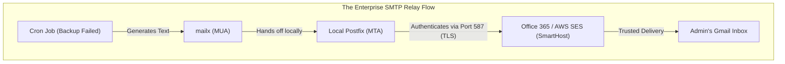
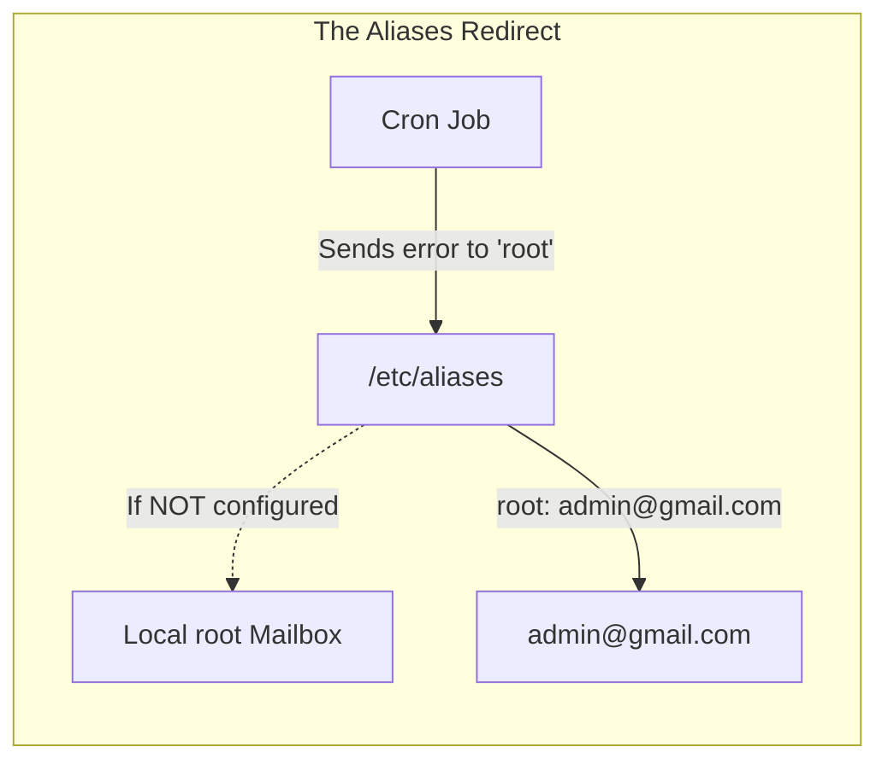
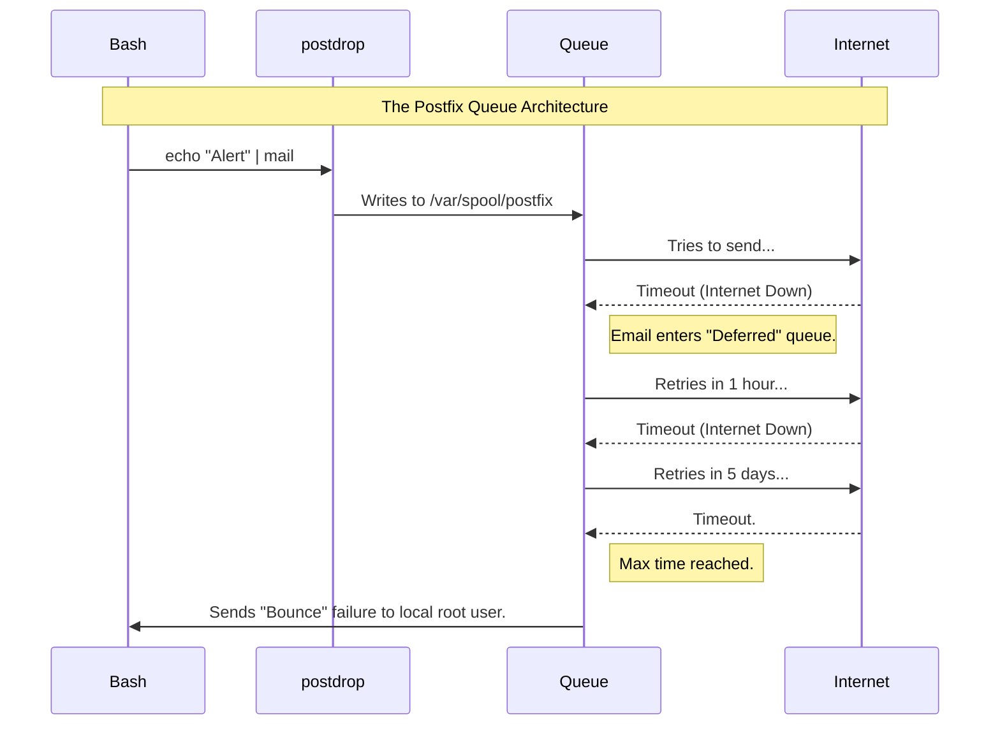

# CHAPTER 72 — POSTFIX AND MAIL TRANSFER AGENTS (MTA)

---

## 1. Introduction

### Why This Topic Exists
When a cron job fails at 3:00 AM, or a web application needs to send a "Password Reset" email to a customer, the server must be able to send an email. But Linux servers do not inherently know how to speak to Google or Microsoft's mail servers. To send emails, a Linux server must run a specialized daemon called a **Mail Transfer Agent (MTA)**. While legacy systems used `sendmail`, modern Linux distributions use **Postfix**.

### Why Linux Administrators Use It
Administrators use Postfix for two distinct purposes. First, as a full-blown corporate email server (receiving and routing employee emails). However, building a secure, spam-free corporate email server is incredibly difficult today due to strict anti-spam laws. The second (and vastly more common) purpose is configuring Postfix as a **"Send-Only" Relay**. Administrators configure the Linux server to quietly forward all automated alerts and system emails to a centralized corporate mail server (like Office 365 or AWS SES), which then securely delivers them to the final recipients.

### Why Companies Care About It
Visibility and Deliverability. If a backup script fails and the server cannot send an email, the administrator assumes everything is fine, leading to catastrophic data loss. Furthermore, if the server tries to send an email directly to a customer, Gmail will instantly block it as Spam. By configuring Postfix to securely relay through an authenticated corporate gateway, companies guarantee their critical alerts and customer emails actually reach the Inbox.

---

## 2. Learning Objectives

By the end of this chapter, you will be able to:
- Explain the role of an MTA (Mail Transfer Agent) and the SMTP protocol.
- Install and configure Postfix for basic send-only operations.
- Understand the `main.cf` configuration file.
- Configure Postfix to relay mail through an external SMTP server (SmartHost).
- Read the mail queue and troubleshoot undelivered emails using `/var/log/maillog`.
- Send an email directly from the Linux command line.

---

## 3. Beginner-Friendly Explanation

Think of a Post Office:
- **The Mail (The Alert):** Your cron job writes a letter saying, "The backup failed."
- **The Mailbox (`mail` command):** You drop the letter into the blue mailbox on the corner. 
- **Postfix (The Mail Truck):** Postfix picks up the letter, looks at the ZIP code, and figures out how to drive it to the destination.
- **The SmartHost (The Central Processing Facility):** The Postfix truck doesn't drive all the way to California. It drives the letter to the local sorting facility (e.g., Office 365). Office 365 stamps the letter with a corporate seal of approval and puts it on a jet to California.

---

## 4. Core Theory

### 4.1 MTA vs MUA
- **MTA (Mail Transfer Agent):** The heavy lifting engine. `Postfix`, `Sendmail`, `Exim`. It speaks SMTP (Simple Mail Transfer Protocol) on Port 25. It moves mail between servers.
- **MUA (Mail User Agent):** The client application you look at. Microsoft Outlook, Apple Mail, or the Linux command-line `mailx` tool. It does not route mail; it just hands it to the MTA.

### 4.2 The "Send-Only" Architecture
If you install Postfix on a raw AWS Linux server and send an email to `bob@gmail.com`, Gmail will look at the IP address, realize the server is not a recognized, trusted corporate mail server (no SPF/DKIM records), and instantly throw the email in the Spam folder or delete it entirely. 
To bypass this, administrators configure Postfix as a "Relay" (or SmartHost). Postfix takes the email, encrypts it, logs into an authenticated service like SendGrid, AWS SES, or Office 365 with a username and password, and says, "Please deliver this for me." SendGrid (which is highly trusted by Google) delivers the email cleanly to the Inbox.

### 4.3 The Mail Queue
If Postfix tries to deliver an email, but the destination server is offline, Postfix does not delete the email. It places it in a hidden folder called the "Queue." Postfix will attempt to redeliver the email every few hours for 5 days. If it still fails, it sends a "Bounce" message back to the sender.

---

## 5. Internal Working

### The Aliases File (`/etc/aliases`)
Many local system processes try to email the `root` user when they fail. But the `root` user doesn't check their local Linux mailbox. The `/etc/aliases` file acts as a local redirector. You can configure it so that any email destined for the local `root` account is instantly redirected and forwarded to `steve@company.com`.

---

## 6. Production Architecture



---

## 7. Command-by-Command Explanation

### 7.1 `dnf install postfix mailx`
- **Purpose:** Installs the Postfix MTA and the `mailx` MUA (the command-line tool used to actually compose and send emails).

### 7.2 `systemctl enable --now postfix`
- **Purpose:** Starts the mail server.

### 7.3 `echo "Server is down!" | mail -s "CRITICAL ALERT" admin@company.com`
- **Purpose:** Sends an email. The `echo` command generates the body of the email. It is piped (`|`) into the `mail` command. The `-s` flag defines the Subject Line.

### 7.4 `mailq`
- **Purpose:** Lists all emails currently stuck in the Postfix queue waiting for delivery.

### 7.5 `postqueue -f`
- **Purpose:** Forces Postfix to immediately try to flush (deliver) everything in the queue right now, instead of waiting for the next automated attempt.

---

## 8. Syntax Breakdown

**Configuring a SmartHost Relay (`/etc/postfix/main.cf`)**

To force Postfix to route all outbound mail through a corporate server (like SendGrid), you add these lines to the bottom of the config file:

```text
# 1. The destination server and port
relayhost = [smtp.sendgrid.net]:587

# 2. Enable authentication
smtp_sasl_auth_enable = yes
smtp_sasl_password_maps = hash:/etc/postfix/sasl_passwd
smtp_sasl_security_options = noanonymous

# 3. Enable TLS Encryption (Do not send passwords in plain text!)
smtp_use_tls = yes
```
*(You then put the username and password in the `/etc/postfix/sasl_passwd` file, encrypt it using the `postmap` command, and restart Postfix).*

---

## 9. Parameter Explanation

| `/etc/postfix/main.cf` Setting | Purpose |
|:---|:---|
| `myhostname = web1.company.com` | Defines the fully qualified name of the server. This is attached to the email headers so you know exactly which server sent the alert. |
| `inet_interfaces = loopback-only` | **CRITICAL SECURITY.** This ensures Postfix only accepts mail generated by the local server (127.0.0.1). If you set this to `all`, hackers on the internet can connect to your server and use it to blast millions of spam emails, getting your company blacklisted! |
| `mydestination = localhost` | Defines which domains this server considers "local." If an email is sent to `root@localhost`, Postfix delivers it locally instead of sending it out to the internet. |

---

## 10. Sample Output Analysis

**Scenario:** We sent an email using `mailx`, but the recipient never got it. We check the mail log.
**Command:** `tail -f /var/log/maillog`

**Output:**
```text
Jul 26 14:01:00 web1 postfix/pickup[1234]: 3A4B5C6D: uid=0 from=<root>
Jul 26 14:01:00 web1 postfix/cleanup[5678]: 3A4B5C6D: message-id=<20260726.web1>
Jul 26 14:01:00 web1 postfix/qmgr[9101]: 3A4B5C6D: from=<root@web1.com>, size=450, nrcpt=1 (queue active)
Jul 26 14:01:05 web1 postfix/smtp[1121]: 3A4B5C6D: to=<admin@company.com>, relay=smtp.company.com[10.0.5.50]:25, delay=5, delays=0/0/2/3, dsn=5.0.0, status=bounced (host smtp.company.com said: 550 Relaying Denied)
```

**Analysis:**
- **Pickup & Cleanup:** Postfix successfully received the email from the local Linux `root` user.
- **Queue Manager (qmgr):** Postfix placed the email in the active queue.
- **SMTP Engine:** Postfix attempted to deliver the email to `smtp.company.com` on Port 25.
- **Status = Bounced:** The delivery failed with a 550 error. The corporate mail server rejected the email because "Relaying Denied." The Linux administrator must contact the Corporate IT team and ask them to whitelist the Linux server's IP address so it is allowed to relay mail.

---

## 11. Architecture Diagram


*Linux servers generate hundreds of internal emails to the `root` user. Without configuring `/etc/aliases`, no human will ever see them.*

---

## 12. Workflow Diagram



---

## 13. Real Production Examples

### The Log Watcher Script
An administrator writes a script that scans the Nginx error log. If it finds the word "FATAL", it instantly emails the on-call engineer.
```bash
#!/bin/bash
FATAL_COUNT=$(grep "FATAL" /var/log/nginx/error.log | wc -l)

if [ "$FATAL_COUNT" -gt 0 ]; then
    echo "There were $FATAL_COUNT fatal errors today!" | mail -s "URGENT NGINX ERROR" oncall@company.com
fi
```
Because Postfix is perfectly configured as a SmartHost, the on-call engineer's phone buzzes 2 seconds later.

### Emptying a Frozen Queue
A misconfigured script goes crazy and tries to send 50,000 emails to an invalid address. The Postfix queue is completely jammed, and legitimate alerts cannot get out. The administrator needs to nuke the entire queue.
```bash
# Delete all emails in the queue instantly
postsuper -d ALL
```

---

## 14. Common Mistakes

1. **Open Relays** — If an administrator sets `inet_interfaces = all` (listening to the internet) and `mynetworks = 0.0.0.0/0` (trusting the internet), they have created an "Open Relay." Hackers will find it in hours and use the server to send millions of Viagra emails. The server's IP will be permanently blacklisted by Google, Microsoft, and spam authorities. ALWAYS restrict `inet_interfaces` to `localhost` unless you are actively building a corporate mail server.
2. **Forgetting `newaliases`** — An administrator edits `/etc/aliases`, adds the line `root: myemail@gmail.com`, saves the file, and exits. The redirects do not work. `/etc/aliases` is a text file. Postfix can only read binary database files. After editing the text file, the administrator MUST run the `newaliases` command, which compiles the text file into a `.db` binary file that Postfix instantly reads.
3. **Port 25 Blocking** — Most cloud providers (AWS, Azure, DigitalOcean) permanently block outbound traffic on Port 25 to stop spam. If you configure Postfix to send mail directly (without a SmartHost), the packets will silently drop at the edge of the AWS network. You MUST relay through a SmartHost using Port 587 or 465 (which are not blocked).

---

## 15. Best Practices

- **Test with `telnet` / `nc`:** If Postfix cannot deliver to your corporate SmartHost, don't waste hours editing `main.cf`. Ensure the network is actually open first. Run `nc -vz smtp.company.com 25`. If it times out, a firewall is blocking you. If it succeeds, the network is fine and the issue is in your Postfix configuration.
- **Monitoring the Queue:** An alerting system is useless if the alerts get stuck in the queue. Enterprise monitoring tools (like Zabbix or Datadog) should be configured to run `mailq | tail -n 1`. If the queue contains more than 10 emails, it triggers a massive alarm, because the alerting system itself is broken!

---

## 16. Security Considerations

- **Sender Address Spoofing:** By default, if a script running as the `apache` user sends an email, the sender address will be `apache@webserver1.localdomain`. If you send this to a corporate SmartHost, the SmartHost will often reject it because `webserver1.localdomain` is not a real, valid internet domain. You must configure Postfix "Sender Canonical Mapping" to rewrite the "From" address to a valid corporate address (e.g., `alerts@company.com`) before the email leaves the Linux server.

---

## 17. Performance Considerations

- **Memory Footprint:** Postfix is incredibly lightweight and modular. Unlike older monolithic mail servers, Postfix spawns tiny, independent processes for picking up mail, queuing it, and delivering it. A standard Postfix send-only instance consumes less than 20MB of RAM.

---

## 18. Troubleshooting Guide

| Symptom | Root Cause | Resolution |
|:---|:---|:---|
| Email never arrives | Blocked port or Bad Relay | Check `/var/log/maillog`. Look for `status=bounced` or `Connection timed out`. |
| `mail: command not found` | Missing MUA | Postfix is installed, but the client isn't. Run `dnf install mailx`. |
| Queue is massive | Relay is rejecting mail | Run `mailq`. Read the error message next to the stuck emails. Fix the relay, then run `postqueue -f`. |

---

## 19. Practical Labs

**Lab 72.1:** Sending Local Mail
1. Install: `sudo dnf install postfix mailx -y`
2. Start: `sudo systemctl enable --now postfix`
3. Create a new standard user: `sudo useradd bob`
4. Send an email to Bob:
   `echo "Hello Bob, please check the logs." | mail -s "Task Alert" bob`
5. Switch to Bob: `su - bob`
6. Check Bob's mail: Type `mail`. (You will see a text-based inbox! Press `1` to read the email, `q` to quit).

**Lab 72.2:** Configuring Aliases
1. Edit the aliases file: `sudo vim /etc/aliases`
2. Scroll to the absolute bottom. Add this line:
   `root: bob`
3. Save the file.
4. **CRITICAL:** Compile the database: `sudo newaliases`
5. Send an email to root:
   `echo "The database is on fire." | mail -s "CRITICAL" root`
6. Switch to Bob: `su - bob`
7. Type `mail`. Bob received the email destined for root!

---

## 20. Mini Project

The System Log Monitor.
1. Write a script `monitor.sh` that checks how full the `/` partition is.
2. If it is over 80%, have it send an email to the `root` user using `mailx`.
3. Because you configured the `/etc/aliases` file in Lab 72.2, the email will instantly redirect to the `bob` user.
4. Check Bob's mailbox to verify the alert worked.
*(In a real enterprise, `/etc/aliases` would redirect `root` to an external email like `IT-Team@company.com`, and Postfix would relay it through AWS SES to the IT team's phones).*

---

## 21. Assignments

1. Why do Linux administrators typically configure Postfix as a "SmartHost Relay" rather than letting it send emails directly to Gmail/Yahoo?
2. What is the difference between an MTA (Postfix) and an MUA (mailx)?
3. What critical command must you run immediately after editing the `/etc/aliases` text file?

---

## 22. Interview Questions

### Basic
1. **Q: You need to send a quick email from a Bash script to notify you that a task finished. What command do you pipe the text into?**
   A: `mail` or `mailx`.

2. **Q: What is the absolute most important log file to check when troubleshooting email delivery issues on a Linux server?**
   A: `/var/log/maillog` (or `/var/log/mail.log` on Ubuntu).

### Intermediate
3. **Q: You run `mailq` and see 500 emails stuck in the queue. You check the logs and see they failed because of a temporary DNS error. You fixed the DNS error. Postfix is designed to wait a few hours before trying again. How do you force Postfix to try delivering all 500 emails right now?**
   A: I run the `postqueue -f` (flush) command.

4. **Q: You want to ensure that all automated emails generated by the system for the `root` user are sent to your personal corporate email address instead. How do you accomplish this?**
   A: I edit `/etc/aliases`. I add the line `root: my.name@company.com`. I save the file, and then I execute `newaliases` to compile the database.

### Scenario-Based
5. **Q: You deploy a new Linux server in AWS. You install Postfix. You run `echo "Test" | mail -s "Test" my_address@gmail.com`. The command succeeds with no errors. You wait 10 minutes, but nothing arrives in your Gmail inbox, not even in Spam. You check `/var/log/maillog` and see `Connection timed out`. What is the architectural problem?**
   A: AWS (and almost all cloud providers) aggressively blocks outbound traffic on TCP Port 25 (the default SMTP port) at the hypervisor network level to prevent hackers from spinning up temporary instances to blast spam. Postfix is trying to connect directly to Google's Port 25 mail servers, and the packets are being dropped by AWS. To fix this, I must configure Postfix to use a SmartHost (like Amazon SES or SendGrid) and connect to it over an authenticated, unblocked port like 587 or 465.

---

## 23. Chapter Summary and Quick Revision Notes

- **MTA (Postfix):** The engine that routes and sends mail over SMTP (Port 25/587).
- **MUA (mailx):** The client used to compose the mail.
- **SmartHost / Relay:** Routing outbound mail through a trusted corporate server (AWS SES, O365) to bypass Spam filters and Cloud port blocking.
- **`/etc/aliases`:** Redirects local mail. (e.g., forwarding `root` to an actual human). MUST run `newaliases` after editing!
- **`mailq`:** Shows emails stuck in the queue.
- **`postqueue -f`:** Forces the queue to flush/deliver immediately.
- **`inet_interfaces = loopback-only`:** Prevents the server from becoming an Open Relay for spammers.

---

## 24. Cheat Sheet

| Command | Purpose |
|:---|:---|
| `echo "Body" \| mail -s "Subj" user@domain` | Send an email from the terminal |
| `mailq` | View the mail queue |
| `postqueue -f` | Flush the queue |
| `postsuper -d ALL` | Delete everything in the queue |
| `newaliases` | Compile `/etc/aliases` changes |
| `tail -f /var/log/maillog` | Live monitor mail delivery attempts |
