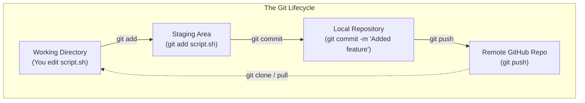
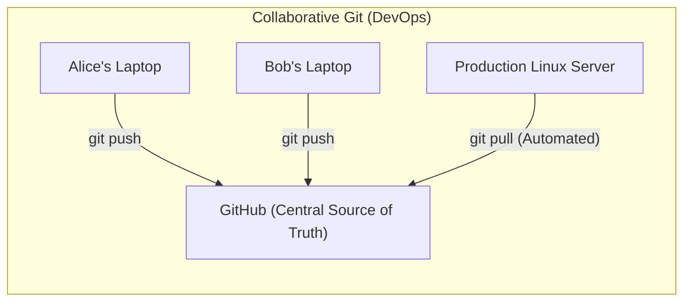
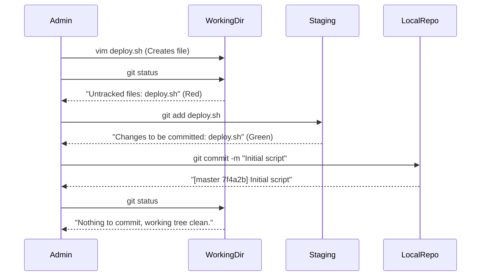

# CHAPTER 74 — GIT VERSION CONTROL BASICS

---

## 1. Introduction

### Why This Topic Exists
For decades, Linux administrators treated servers like "pets". If a server needed a configuration change, they SSH'd in, edited a text file, saved it, and logged out. If that change crashed the server, the admin frantically tried to remember exactly what they deleted, often failing and destroying the server. The modern DevOps philosophy says servers are "cattle", and configurations must be treated exactly like software code. **Git** is the industry standard Version Control System (VCS) that tracks every single change made to a file, who made the change, when they made it, and most importantly, allows you to instantly roll back a catastrophic mistake with a single command.

### Why Linux Administrators Use It
System administrators use Git to store all their Bash automation scripts, Ansible playbooks, and Dockerfiles. Instead of having a folder called `scripts_v1`, `scripts_v2`, `scripts_FINAL`, they have a single Git repository. Furthermore, when working on a team of 10 administrators, Git allows all 10 people to edit the exact same script simultaneously without destroying each other's work.

### Why Companies Care About It
Disaster Recovery, Auditing, and Collaboration. If a hacker breaches a server and changes a script, Git instantly highlights exactly which lines of code the hacker modified. If an administrator accidentally deletes the master database script, it doesn't matter, because a perfect historical copy exists safely in the cloud on **GitHub** or **GitLab**. It is the absolute foundation of modern IT infrastructure.

---

## 2. Learning Objectives

By the end of this chapter, you will be able to:
- Explain the difference between Git (the tool) and GitHub (the service).
- Initialize a local repository and track files.
- Understand the 3 stages of a file: Working Directory, Staging Area, and Committed.
- View the history of changes using `git log` and `git diff`.
- Roll back a mistake using `git checkout` or `git revert`.
- Push local code to a remote repository securely via SSH keys.

---

## 3. Beginner-Friendly Explanation

Think of writing a legal contract:
- **No Git:** You write the contract. You send it to your lawyer. The lawyer changes a paragraph and sends it back. You can't remember what the original paragraph looked like.
- **Git:** Git is a magical photocopier. 
  - Every time you finish a page, you take a photocopy (a **Commit**). 
  - The photocopier stamps the date, time, and your name on it. 
  - If your lawyer ruins page 3, you just go to the photocopier, pull out the pristine version of page 3 from yesterday, and instantly replace the bad one.
  - **GitHub** is just a massive, fireproof vault in the cloud where you store the photocopies so they don't burn down with your house.

---

## 4. Core Theory

### 4.1 Git vs GitHub
- **Git:** The open-source command-line tool installed on your Linux server. It works perfectly fine completely offline.
- **GitHub / GitLab / Bitbucket:** Cloud websites that host Git repositories. They provide a beautiful web interface, issue tracking, and a centralized hub for teams to share their code.

### 4.2 The Three Trees (Stages)
This is the most critical concept in Git. A file moves through three distinct areas:
1. **Working Directory:** The actual files you are currently editing on your hard drive. (Untracked or Modified).
2. **Staging Area (Index):** You use `git add` to move files here. Think of it as putting items into a shipping box. You can put 5 files in the box and take 1 out before sealing it.
3. **The Repository (Committed):** You use `git commit` to seal the box with tape. It creates a permanent snapshot in history, wrapped in a cryptographic hash (SHA-1).

### 4.3 Branching
If you want to test a crazy new feature in a script, you don't edit the master script. You create a **Branch**. A branch is an exact parallel universe of your code. You can make 50 changes in your branch, test them, and if it fails, you just delete the branch. The master script remains untouched. If it succeeds, you "Merge" the branch back into the master.

---

## 5. Internal Working

### The `.git` Directory
When you type `git init` in a folder, Git creates a hidden directory named `.git`. This folder contains the entire compressed history of every file, every branch, and every commit you have ever made. If you copy a project to a USB drive but forget the `.git` folder, you just have raw text files; the entire history is lost. If you delete the `.git` folder, the directory ceases to be a Git repository.

---

## 6. Production Architecture



---

## 7. Command-by-Command Explanation

### 7.1 `git config --global user.name "Alice"`
- **Purpose:** Git refuses to let you commit code anonymously. You must tell Git your name and email. This is stamped onto every commit you make so the team knows who broke the server.

### 7.2 `git init`
- **Purpose:** Initializes an empty Git repository in the current directory.

### 7.3 `git status`
- **Purpose:** **The most important command.** Tells you exactly what stage your files are in (Untracked, Modified, Staged). Run this constantly.

### 7.4 `git add backup.sh`
- **Purpose:** Moves the file from the Working Directory into the Staging Area.

### 7.5 `git commit -m "Added automatic retry logic"`
- **Purpose:** Takes everything in the Staging Area and permanently locks it into history. The `-m` is the Message. It must be descriptive. (A message like "fixed stuff" will get you fired).

---

## 8. Syntax Breakdown

**Viewing the History (`git log`)**

```bash
git log --oneline
```
**Output:**
```text
a1b2c3d (HEAD -> master) Fixed typo in database password
e4f5g6h Added database backup script
i7j8k9l Initial commit
```
- **a1b2c3d**: The first 7 characters of the SHA-1 hash. This is the unique ID of the commit.
- **HEAD**: A pointer that indicates exactly where you are currently looking in the history.
- **master (or main)**: The name of the default branch.

---

## 9. Parameter Explanation

| Command | Purpose |
|:---|:---|
| `git diff` | Shows the exact line-by-line differences between the file you are editing now, and the last time you committed it. |
| `git clone <URL>` | Downloads a complete repository from GitHub to your local server. |
| `git push origin main` | Uploads your local commits to the `main` branch on GitHub (`origin`). |
| `git pull` | Downloads the newest commits from GitHub and merges them into your local files. |

---

## 10. Sample Output Analysis

**Scenario:** We edited a file, realized we made a terrible mistake, and want to undo all our changes back to the last commit.
**Command:** `git checkout -- backup.sh`
*(Note: In newer versions of Git, this is `git restore backup.sh`)*

**Output:** (No output).
**Analysis:**
- Git silently replaced the corrupted `backup.sh` in your Working Directory with the pristine version stored in the `.git` repository from the last time you committed. You have instantly time-traveled backwards and saved your script.

---

## 11. Architecture Diagram


*In DevOps, administrators do NOT log into the Production server and edit scripts directly. They edit scripts on their laptops, push them to GitHub, and a pipeline automatically pushes the changes from GitHub to the Production server. This guarantees GitHub always has a perfect copy of production.*

---

## 12. Workflow Diagram



---

## 13. Real Production Examples

### The `.gitignore` File
You are writing a script that creates massive 50GB temporary database dumps in the same folder. You run `git add .` (which adds EVERYTHING in the folder). Git attempts to add a 50GB database dump to version control, completely crashing your computer.
To prevent this, you create a text file named `.gitignore` and add the line:
`*.sql`
Git will now permanently and silently ignore all `.sql` files, ensuring only your scripts are tracked.

### Blaming a Coworker (`git blame`)
A critical script crashes on a Saturday. You open it and see a bizarre `rm -rf` command on line 45. You need to know exactly who added that line and when.
You run: `git blame deploy.sh`
Git prints the file, but next to every single line of code, it prints the name of the person who wrote it, the date, and the commit hash.
`a4f2b1d (Alice Smith 2026-10-14 14:00:00) rm -rf /`
You now know exactly who to call.

---

## 14. Common Mistakes

1. **Committing Passwords (CRITICAL)** — If you hardcode a database password into `script.sh` and run `git commit`, that password is now permanently locked into the Git history. Even if you edit the file, delete the password, and commit again, a hacker can easily type `git log`, find the older commit, and read the password. If you push this to public GitHub, bots will scrape the password in 3 seconds and hack your server. NEVER commit secrets.
2. **"Detached HEAD" State** — You want to look at an old commit from last week. You type `git checkout a1b2c3d`. Git warns you about a "Detached HEAD". You ignore it, make 5 changes, and commit them. Later, you type `git checkout main` to go back to the present. All 5 of those changes vanish into the ether, because you weren't on a Branch! If you travel back in time and want to make changes, you MUST create a branch: `git checkout -b new_fix a1b2c3d`.
3. **Merge Conflicts** — Alice edits Line 10 of a file. Bob edits Line 10 of the *exact same file*. Alice pushes to GitHub. Bob tries to push to GitHub. GitHub rejects Bob and screams `MERGE CONFLICT`. Git doesn't know whose Line 10 is correct. Bob must manually open the file, resolve the conflict, and commit again.

---

## 15. Best Practices

- **Commit Small, Commit Often:** Do not write 5,000 lines of code over 3 weeks and make a single commit titled "Did a lot of work." A commit should be a small, logical unit of work (e.g., "Added error handling to backup function"). If a specific feature breaks the server, you want to be able to roll back just that one small commit.
- **Write Good Commit Messages:**
  - Bad: `fixed bug`
  - Good: `Fixed variable typo in the database connection string that caused timeout`

---

## 16. Security Considerations

- **SSH Keys for GitHub:** When you try to `git push` code from your Linux server to GitHub, GitHub requires authentication. In 2021, GitHub banned the use of standard passwords for command-line Git. You MUST generate an SSH key on your Linux server (`ssh-keygen`), log into the GitHub website, and paste the Public Key into your account settings. Git will then authenticate seamlessly via SSH without ever asking for a password.

---

## 17. Performance Considerations

- **Git Repositories are NOT Backup Systems:** Git tracks changes to text files efficiently. It is terrible at tracking changes to binary files (like `.mp4` videos or `.zip` files). If you commit a 1GB `.zip` file, change one file inside it, and commit it again, Git copies the entire 1GB file into history. Your `.git` folder is now 2GB. If you do this daily, your `.git` folder will hit 50GB and crash. Use `git` for text/code ONLY.

---

## 18. Troubleshooting Guide

| Symptom | Root Cause | Resolution |
|:---|:---|:---|
| `fatal: not a git repository` | Missing `.git` folder | Run `git init` to create the repository. |
| `Please tell me who you are.` | Missing config | Run `git config --global user.email "you@com"` |
| File stays red after `git status`| Not staged | You must run `git add <file>` before committing. |
| `git push` asks for a password and fails | GitHub deprecated passwords | Use an SSH key or a Personal Access Token (PAT). |

---

## 19. Practical Labs

**Lab 74.1:** The Local Repository Lifecycle
1. `mkdir /tmp/git_lab && cd /tmp/git_lab`
2. `git init`
3. Check status: `git status` (Nothing to commit).
4. Create a file: `echo "Version 1" > my_script.sh`
5. Check status: `git status` (File is Red / Untracked).
6. Stage the file: `git add my_script.sh`
7. Check status: `git status` (File is Green / Staged).
8. Commit the file: `git commit -m "Initial commit"`
9. Check the history: `git log`

**Lab 74.2:** Time Travel
1. Break the file: `echo "A terrible bug!" > my_script.sh`
2. View the damage: `cat my_script.sh` (Version 1 is gone).
3. View the diff: `git diff` (Shows red lines deleted, green lines added).
4. Oh no! Roll it back: `git restore my_script.sh` *(Or `git checkout my_script.sh` on older systems)*.
5. Check the file again: `cat my_script.sh` (Version 1 is restored perfectly!).

---

## 20. Mini Project

The Branching Drill.
You have a script named `hello.sh` that works perfectly in the `master` branch. You want to test a new feature safely.
1. Create and switch to a new branch: `git checkout -b new_feature`
2. Verify you moved: `git branch` (The star is next to `new_feature`).
3. Edit `hello.sh`, make a crazy change, and save it.
4. Stage and commit it: `git add hello.sh && git commit -m "Crazy test"`
5. Realize it was a bad idea. Switch back to master: `git checkout master`
6. Look at `hello.sh`. The crazy changes are gone! Your master script is perfectly safe.
7. Delete the failed branch: `git branch -D new_feature`

---

## 21. Assignments

1. What are the three stages a file must pass through before it is permanently stored in Git history?
2. Why is it dangerous to commit secrets (like passwords or API keys) to Git, even if you delete them in a later commit?
3. What is the purpose of the `.gitignore` file?

---

## 22. Interview Questions

### Basic
1. **Q: What command moves a file from the Working Directory into the Staging Area?**
   A: `git add <filename>`

2. **Q: You want to see the history of all commits you have made. What command do you run?**
   A: `git log`

### Intermediate
3. **Q: You are editing a script. You run `git status` and see the file is listed in red under "Changes not staged for commit". You run `git commit -m "Updated script"`. You check GitHub, but the changes aren't there. Why did the commit fail to grab your changes?**
   A: `git commit` only locks files that are in the Staging Area (Green). Because I forgot to run `git add` to move the file into the Staging Area first, the commit was completely empty. (I could have bypassed this by using `git commit -a -m "msg"`, which automatically stages and commits tracked files).

4. **Q: A Junior Admin tells you they are going to "upload their code to Git." You politely correct their terminology. Explain the difference between Git and GitHub.**
   A: Git is the underlying command-line engine and mathematical protocol that tracks file changes locally on the hard drive. GitHub is a commercial, third-party cloud hosting service that provides a remote backup location (a Remote) and a web GUI for sharing those local Git repositories with a team.

### Scenario-Based
5. **Q: You are working on a massive Bash automation script with a coworker. You clone the repository, edit the `deploy.sh` file, and commit your changes locally. You run `git push` to send them to GitHub. The push violently fails, stating `Updates were rejected because the remote contains work that you do not have locally`. What happened, and how do you resolve it?**
   A: While I was working on my laptop, my coworker edited the exact same repository and pushed their changes to GitHub first. My local repository is now out-of-date compared to the central server. Git blocks me from pushing because my push would overwrite and destroy my coworker's changes. To fix this, I must first run `git pull`. This downloads my coworker's changes and merges them with mine. If we edited the exact same lines, it will create a "Merge Conflict" that I must manually fix. Once merged locally, I can successfully `git push` the combined code.

---

## 23. Chapter Summary and Quick Revision Notes

- **Git:** The VCS engine. **GitHub:** The cloud storage for Git.
- **Working Directory (Red):** Files you are currently typing in.
- **Staging Area (Green):** Files queued up for the next commit.
- **Repository (Committed):** Permanent historical snapshots.
- **`git init`:** Creates the `.git` folder.
- **`git log`:** View history.
- **`git clone`:** Download a repository from the internet.
- **Branches:** Parallel universes for safely testing new features without breaking production code.
- **`.gitignore`:** Prevents massive binaries or secret files from accidentally being tracked.

---

## 24. Cheat Sheet

| Command | Purpose |
|:---|:---|
| `git init` | Start tracking a directory |
| `git status` | View the state of all files (Run this constantly) |
| `git add .` | Stage EVERYTHING in the directory |
| `git commit -m "Msg"` | Lock staged files into history |
| `git log --oneline` | View history compactly |
| `git diff` | Show exact line changes |
| `git checkout -b name`| Create and switch to a new branch |
| `git pull` | Download changes from remote |
| `git push` | Upload local commits to remote |
