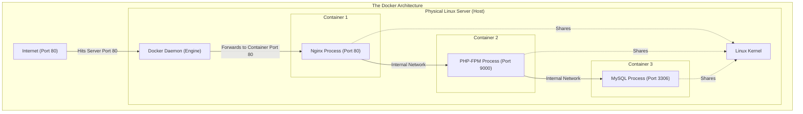
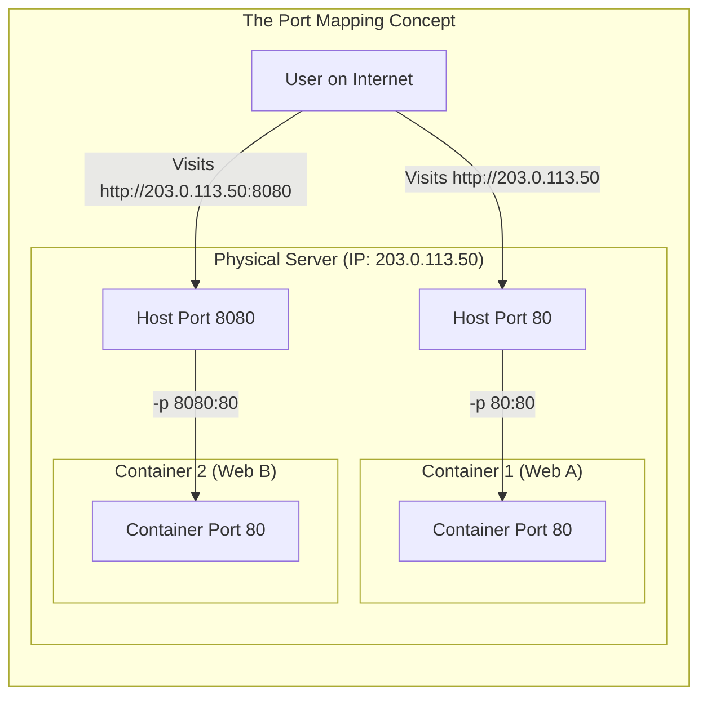
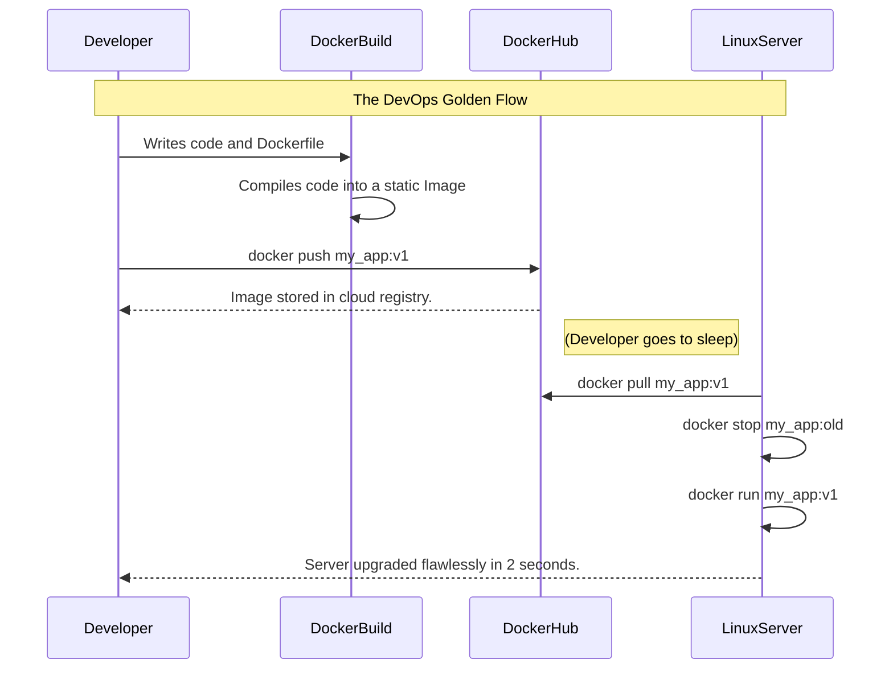

# CHAPTER 75 — DOCKER AND CONTAINERIZATION FUNDAMENTALS

---

## 1. Introduction

### Why This Topic Exists
For 20 years, developers said, "The code works on my laptop," and system administrators replied, "Well, it crashes on the production server." The reason was simple: the developer's laptop had Python 3.8 and Ubuntu, while the server had Python 3.6 and RHEL. There was always a dependency mismatch. **Docker** solved this forever. It allows a developer to package their code, the exact version of Python they need, and the exact operating system libraries into a single, unbreakable box (a **Container**). This box runs identically on a laptop, a test server, or in the AWS cloud.

### Why Linux Administrators Use It
Linux administrators no longer spend hours running `dnf install` and carefully compiling Apache, PHP, and MySQL on a raw server. Instead, they just install the Docker Engine. Then they download pre-built, perfectly configured containers for Nginx, WordPress, and MySQL. If a container breaks, they don't troubleshoot the Linux OS; they just delete the container and launch a fresh one in 2 seconds.

### Why Companies Care About It
Server Density and Cost Savings. Historically, if a company had 5 applications, they bought 5 physical servers. Then came Virtual Machines (VMware), allowing them to put 5 VMs on 1 server. But each VM requires a full 20GB copy of Linux and 2GB of RAM just to sit idle. 
Containers share the host's Linux kernel. They don't have a 20GB OS. An Nginx container is only 15 Megabytes. A company can run 500 Docker containers on a single physical server, maximizing hardware efficiency and saving millions in cloud computing costs.

---

## 2. Learning Objectives

By the end of this chapter, you will be able to:
- Explain the architectural difference between a Virtual Machine and a Container.
- Install the Docker Engine on Linux.
- Pull images from Docker Hub.
- Run, stop, and inspect containers (`docker run`, `docker ps`).
- Map network ports to expose containers to the internet (`-p 80:80`).
- Map persistent storage volumes (`-v /data:/app`).
- Read and write a basic `Dockerfile`.

---

## 3. Beginner-Friendly Explanation

Think of shipping cargo across the ocean:
- **Pre-Docker (The old way):** You want to ship a Piano, a Car, and 1,000 loose Apples. You throw them all in the bottom of a ship. The car crushes the piano, the apples rot, and unloading the ship takes 3 weeks.
- **Virtual Machines:** You buy 3 separate ships. One for the piano, one for the car, one for the apples. Very safe, but incredibly expensive.
- **Docker:** You put the Piano in a standard steel shipping box (Container). You put the Car in a steel box. You put the Apples in a steel box. You stack all 3 boxes perfectly on the exact same ship. They don't crush each other. They are isolated, safe, and can be unloaded in minutes using standard cranes.

---

## 4. Core Theory

### 4.1 Images vs Containers
- **Image:** The blueprint. It is a read-only template (e.g., "Ubuntu 22.04 with Nginx installed"). You download Images from a registry like **Docker Hub**. An Image is sitting on your hard drive, doing nothing.
- **Container:** The running instance. When you execute an Image, it becomes a Container. A Container is a living, breathing process consuming RAM and CPU. You can launch 50 Containers from a single Image.

### 4.2 Containers vs Virtual Machines
- **Virtual Machine (VM):** Requires a Hypervisor (VMware/KVM). Every VM has its own completely separate Linux Kernel, virtual hard drive, and virtual motherboard. Boot time: 30 seconds. Size: 20GB.
- **Container:** Does NOT have a Linux Kernel. A container is literally just a restricted Linux process that *borrows* the Host server's kernel. Boot time: 0.1 seconds. Size: 50MB. (Because containers rely on the Linux kernel, you cannot natively run a Windows container on a Linux server).

### 4.3 Ephemeral State (Statelessness)
By default, Containers have amnesia. If you launch a MySQL container, create a database, and then the container crashes or gets deleted... the database is permanently destroyed. Containers are designed to be thrown away. If you need data to survive (like a database), you MUST map a directory from the physical host server into the container (a **Volume**).

---

## 5. Internal Working

### Namespaces and Cgroups
Docker is not actually a virtualization technology. It is built entirely on two core features of the Linux Kernel:
1. **Namespaces:** Provide isolation. Docker puts the process in a "Network Namespace" so it thinks it has its own IP address, and a "PID Namespace" so it thinks it is process #1.
2. **Cgroups (Control Groups):** Provide resource limits. Docker tells the kernel, "Do not let this process consume more than 512MB of RAM, even if it tries."

---

## 6. Production Architecture



---

## 7. Command-by-Command Explanation

### 7.1 `dnf install docker-ce docker-ce-cli containerd.io`
- **Purpose:** Installs the Community Edition of the Docker Engine. (Note: RHEL/Rocky officially pushes a tool called `podman` which is identical to Docker, but installing official Docker CE is still standard practice).

### 7.2 `docker pull nginx:latest`
- **Purpose:** Reaches out to Docker Hub, downloads the official, pre-built Nginx Image, and saves it to your hard drive.

### 7.3 `docker run -d -p 8080:80 --name my_web nginx`
- **Purpose:** Launches a Container.
  - `-d`: Detached mode. (Run in the background so you get your bash prompt back).
  - `-p 8080:80`: Port mapping. Take Port 8080 on the *physical Linux server*, and forward traffic into Port 80 *inside the container*.
  - `--name my_web`: Gives the container a human-readable name, instead of a random UUID.
  - `nginx`: The Image to use.

### 7.4 `docker ps`
- **Purpose:** Lists all currently running containers, showing their IDs, Names, and Port Mappings. (Use `docker ps -a` to see stopped/crashed containers).

### 7.5 `docker exec -it my_web /bin/bash`
- **Purpose:** **CRITICAL ADMIN COMMAND.** You cannot SSH into a container. This command injects you directly into the running container, giving you a root bash shell inside the box to troubleshoot it.

---

## 8. Syntax Breakdown

**The `Dockerfile` (Building your own Image)**

If you don't want to use a generic Nginx image from the internet, you can build your own custom image by writing a text file named `Dockerfile`:

```dockerfile
# 1. Start from an existing base image
FROM ubuntu:22.04

# 2. Run standard Linux commands inside the image to build it
RUN apt-get update && apt-get install -y apache2

# 3. Copy files from your physical hard drive INTO the image
COPY ./my_website /var/www/html/

# 4. Tell Docker what port this application uses
EXPOSE 80

# 5. The command that runs forever when the container is turned on
CMD ["apache2ctl", "-D", "FOREGROUND"]
```
*(You compile this file by running `docker build -t my_custom_apache .`)*

---

## 9. Parameter Explanation

| `docker run` Flag | Purpose |
|:---|:---|
| `-v /host/dir:/container/dir` | **Volumes.** Mounts a physical folder from the server into the container. Required for databases so data survives if the container crashes. |
| `--restart always` | If the physical Linux server reboots, the Docker daemon will automatically start this container back up when the server comes online. |
| `-e MYSQL_ROOT_PASSWORD=pass`| **Environment Variables.** Passes passwords or configuration strings directly into the container so you don't have to hardcode them. |
| `--rm` | Automatically deletes the container the exact second it stops running (great for temporary test scripts). |

---

## 10. Sample Output Analysis

**Scenario:** We want to see what is consuming CPU inside our running container.
**Command:** `docker stats my_web`

**Output:**
```text
CONTAINER ID   NAME      CPU %     MEM USAGE / LIMIT     MEM %     NET I/O           BLOCK I/O
a1b2c3d4e5f6   my_web    0.02%     12.5MiB / 31.3GiB     0.04%     1.5kB / 600B      0B / 0B
```

**Analysis:**
- The container is essentially asleep (0.02% CPU).
- It is only using 12.5 Megabytes of RAM. (This proves the massive efficiency over VMs).
- **MEM LIMIT:** 31.3GiB. Because we did not apply Cgroup limits, this single container is theoretically allowed to consume the entire physical RAM of the host server. In enterprise production, administrators must add `-m 512m` to the `docker run` command to strict limit the container to 512MB.

---

## 11. Architecture Diagram


*Containers think they are the only thing running. Both containers are listening on Port 80 internally. The Docker Engine uses iptables NAT to map different physical Host ports to the internal Container ports.*

---

## 12. Workflow Diagram



---

## 13. Real Production Examples

### The Instant Database For Testing
A developer needs a PostgreSQL database to test a script. Instead of the Linux Administrator spending 3 hours installing PostgreSQL, configuring `pg_hba.conf`, and securing the server, they run ONE command:
```bash
docker run -d --name test_db \
  -e POSTGRES_PASSWORD=supersecret \
  -p 5432:5432 postgres
```
In exactly 3 seconds, a fully functional PostgreSQL database is running on the server. When the developer is done testing 10 minutes later, the admin runs `docker rm -f test_db` and the database is completely vaporized, leaving the Linux server perfectly clean.

### The Immutable Upgrade
An administrator needs to upgrade a WordPress blog. In the old days, they would run an upgrade script, and if it failed, the server was corrupted.
With Docker, the admin leaves the `wordpress:v1` container running. They download `wordpress:v2`. They point the v2 container at the exact same physical database Volume. If v2 works, they delete v1. If v2 crashes, they instantly turn v1 back on. There is zero risk.

---

## 14. Common Mistakes

1. **Forgetting Persistent Volumes** — A junior admin runs a MySQL container: `docker run -d mysql`. They create 50 user accounts. The next day, the server reboots. The container restarts. ALL THE DATA IS GONE. Why? Because the data was written *inside* the ephemeral container. You MUST use `-v /opt/mysql_data:/var/lib/mysql`. This tells Docker to save the database files to the physical Linux hard drive (`/opt/`), not inside the container.
2. **Running Containers as Root** — By default, the process inside a container runs as the `root` user. If a hacker breaches the web application, they have root access *inside* the container. If they manage to "escape" the container (via a Kernel exploit), they now have root access to the physical server. Production Dockerfiles should always specify `USER nginx` or a non-root user to drop privileges.
3. **Leaving Orphaned Images** — Every time you type `docker pull ubuntu`, you download a 100MB image. If you do this 500 times over a year, your server's hard drive will hit 100% full. You must occasionally run `docker system prune` to delete old, unused Images and Containers.

---

## 15. Best Practices

- **One Process Per Container:** Do not install Apache, MySQL, and Postfix into a single container. If one process crashes, the whole container dies and it is impossible to troubleshoot. Launch 3 separate containers and network them together. This is the foundation of **Microservices**.
- **Use `.dockerignore`:** Similar to Git, when you build an image, Docker copies your folder into the image. If you have a 5GB database dump in your folder, your resulting Docker Image will be 5GB. Use `.dockerignore` to block large, unnecessary files from being compiled into the image.

---

## 16. Security Considerations

- **The Docker Socket:** If a Linux user has permission to talk to the Docker Daemon, they effectively have `root` access to the physical server (because they can launch a container, mount the physical `/` drive into it, and edit `/etc/shadow`). You should never add standard developers to the `docker` Linux group on a production server. Only CI/CD automation pipelines and senior administrators should have Docker access.

---

## 17. Performance Considerations

- **Alpine Linux:** When building images, `FROM ubuntu` downloads a 70MB base OS. If you use `FROM alpine`, it downloads a 5MB base OS. Alpine is a minimalist Linux distribution built specifically for containers. Using Alpine results in ultra-fast download times, smaller attack surfaces for hackers, and significantly reduced disk usage.

---

## 18. Troubleshooting Guide

| Symptom | Root Cause | Resolution |
|:---|:---|:---|
| `Cannot connect to the Docker daemon` | Service is dead / Permissions | Run `systemctl start docker`. Ensure your user is `root` or in the `docker` group. |
| `Bind for 0.0.0.0:80 failed: port is already allocated`| Port Conflict | You tried to run `-p 80:80`, but Nginx is already running natively on the physical server on Port 80. |
| Container starts and instantly exits | No foreground process | Containers must have a process running permanently in the foreground. If the command finishes, the container dies. |
| Changes to files disappear after restart | No Volume mapped | You edited files inside the ephemeral layer. Map a physical Volume (`-v`). |

---

## 19. Practical Labs

**Lab 75.1:** Hello World
1. Check if Docker is installed: `docker --version`
2. Run your first container: `sudo docker run hello-world`
   *(Docker will realize you don't have the image, pull it from the internet, run it, print a welcome message, and exit).*

**Lab 75.2:** Running a Web Server
1. Launch Nginx in the background on Port 8080:
   `sudo docker run -d -p 8080:80 --name my_first_web nginx`
2. Open a web browser on your computer and go to `http://<Server_IP>:8080`. You will see the "Welcome to nginx!" page.
3. Check it is running: `sudo docker ps`
4. Jump inside the container: `sudo docker exec -it my_first_web /bin/bash`
5. Inside the container, look around! Type `ls /`. Type `exit` to get back to your physical server.
6. Destroy the container: `sudo docker rm -f my_first_web`

---

## 20. Mini Project

The Persistent Website.
You want to host a website, but you want the HTML files safely stored on your physical hard drive, not trapped inside the container.
1. `mkdir /tmp/website`
2. `echo "<h1>Docker is Magic</h1>" > /tmp/website/index.html`
3. Launch the container, mapping that physical folder into the container's Nginx html directory:
   `sudo docker run -d -p 80:80 -v /tmp/website:/usr/share/nginx/html --name custom_web nginx`
4. `curl localhost`. It prints "Docker is Magic"!
5. Edit the file on the host: `echo "<h1>Updated Live</h1>" > /tmp/website/index.html`
6. `curl localhost`. It updated instantly without restarting the container! The container is just acting as a lens reading the physical file.

---

## 21. Assignments

1. Why are Docker Containers significantly faster to boot and more resource-efficient than Virtual Machines (VMware)?
2. If you launch a MySQL container without mapping a Volume (`-v`), what happens to the database when you run `docker rm -f mysql_container`?
3. What is the difference between an Image and a Container?

---

## 22. Interview Questions

### Basic
1. **Q: What command downloads a Docker Image from Docker Hub to your local hard drive?**
   A: `docker pull <image_name>`

2. **Q: You run `docker ps` and it shows nothing. You know a container crashed 5 minutes ago. How do you see stopped or crashed containers?**
   A: `docker ps -a` (The `-a` means "all").

### Intermediate
3. **Q: You launch a web container using `docker run -d -p 8080:80 nginx`. Your physical Linux server IP is 10.0.1.50. When a customer on the internet types `http://10.0.1.50:80`, the connection is refused. Why?**
   A: The port mapping is `HostPort:ContainerPort`. I mapped Port 8080 on the Host to Port 80 in the container. The customer must visit `http://10.0.1.50:8080`. If I want them to visit standard Port 80, the command must be `-p 80:80`.

4. **Q: What command do you use to drop into a root bash shell inside a running container to troubleshoot it?**
   A: `docker exec -it <container_name> /bin/bash` (or `/bin/sh` if it is an Alpine image).

### Scenario-Based
5. **Q: You are hired to modernize a legacy application. The application requires Apache, PHP 5.4 (which is obsolete), and a very specific old version of the `libpng` library. In the past, admins spent days trying to compile this on modern CentOS servers, usually destroying the server due to dependency conflicts. How does Docker permanently solve this exact problem?**
   A: Docker solves this through isolation and the `Dockerfile`. I will write a `Dockerfile` that starts with an older base OS image (e.g., `FROM centos:7`). Inside the Dockerfile, I will run the commands to install the exact legacy versions of PHP and `libpng`. Docker compiles this into a self-contained Image. When I run this container on a modern RHEL 9 server, the container runs perfectly because it brings its own legacy dependencies with it, completely isolated from the modern RHEL 9 host OS, guaranteeing zero dependency conflicts.

---

## 23. Chapter Summary and Quick Revision Notes

- **Docker:** OS-level virtualization. Containers share the Host Linux Kernel.
- **Image:** The read-only blueprint (e.g., `ubuntu:latest`).
- **Container:** The running process spawned from an Image.
- **Dockerfile:** A text file containing the instructions to build a custom Image.
- **Statelessness:** Data inside a container is lost when the container is deleted.
- **Volumes (`-v`):** Maps a physical Host directory into the Container for permanent data storage.
- **Port Mapping (`-p`):** Forwards traffic from a Host Port to an internal Container Port.
- **`docker ps`:** The primary command to see running containers.

---

## 24. Cheat Sheet

| Command | Purpose |
|:---|:---|
| `docker pull ubuntu` | Download an image |
| `docker run -d -p 80:80 nginx` | Launch a container in the background |
| `docker ps -a` | List all containers (running and dead) |
| `docker stop my_con` | Gracefully shut down a container |
| `docker rm -f my_con` | Forcefully kill and delete a container |
| `docker exec -it my_con bash` | Open a shell inside the container |
| `docker logs -f my_con` | Live monitor the container's output logs |
| `docker build -t my_img .` | Compile a Dockerfile in current dir |
