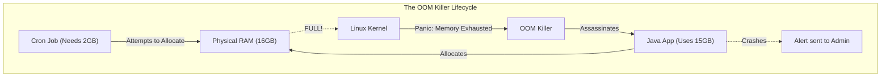
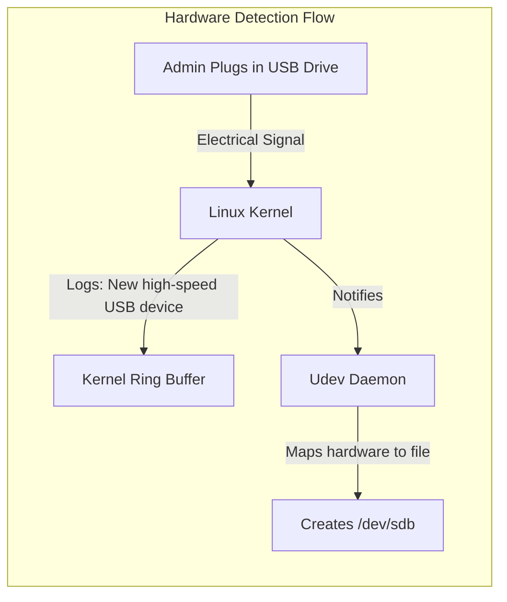
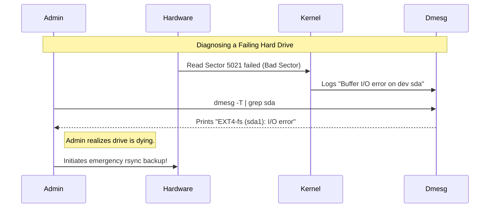

# CHAPTER 77 — THE DMESG COMMAND AND KERNEL PANICS

---

## 1. Introduction

### Why This Topic Exists
When an application like Nginx fails, it writes a nice, human-readable error into `/var/log/nginx/error.log`. But what happens when the physical hard drive on the server starts shooting sparks? What happens when you plug in a USB device and the server doesn't recognize it? What happens when the entire Linux Operating System violently crashes? Nginx cannot log these hardware events. You need a way to look directly into the brain of the Linux Kernel.

### Why Linux Administrators Use It
Linux administrators use the `dmesg` (Display Message) command to read the "Kernel Ring Buffer." This is a highly protected area of memory where the Linux Kernel logs every physical hardware event, driver failure, and catastrophic system error from the exact millisecond the server was powered on.

### Why Companies Care About It
Root Cause Analysis (RCA). If a production database server reboots unexpectedly at 2:00 AM, the company loses money. Management will demand to know *why* it rebooted. Did a hacker do it? Did a cron job do it? Or did a faulty stick of RAM cause a Kernel Panic? The answer to hardware and low-level system failures is almost always found in `dmesg`.

---

## 2. Learning Objectives

By the end of this chapter, you will be able to:
- Explain what the Kernel Ring Buffer is.
- Use `dmesg` to view hardware initialization logs.
- Use `dmesg -H` and `dmesg -w` for easier reading and live monitoring.
- Identify physical hardware devices (like `sda` or `eth0`) as they are detected.
- Diagnose the two most common catastrophic errors: **Kernel Panics** and **OOM Kills**.

---

## 3. Beginner-Friendly Explanation

Think of the human body:
- **Application Logs (`/var/log/`):** You speaking. "I have a headache," or "I am hungry."
- **`dmesg` (The Kernel Log):** The electrical signals in your nervous system. You aren't consciously aware of them. If your liver suddenly stops working, your brain registers a massive emergency signal. `dmesg` is the doctor hooking up a machine to read those raw electrical emergency signals directly from your brain.

---

## 4. Core Theory

### 4.1 The Kernel Ring Buffer
When a Linux server boots, the hard drive isn't even mounted yet. If the hard drive isn't mounted, the kernel cannot write logs to `/var/log/messages`. So where does the kernel store the boot errors? 
It stores them in a **Ring Buffer** in RAM. A Ring Buffer is a fixed size (e.g., 16384 bytes). When it gets full, it doesn't crash; it just loops around and overwrites the oldest messages (like a snake eating its tail). `dmesg` reads this RAM buffer.

### 4.2 The OOM Killer (Out Of Memory)
This is the most common disaster an administrator will find in `dmesg`. If a Linux server has 16GB of RAM, and a poorly written Java application tries to consume 17GB, the server is out of memory. If a computer runs out of memory, the mouse freezes, the keyboard stops working, and the server dies.
To prevent the entire server from dying, the Linux Kernel deploys an assassin called the **OOM Killer**. It scans all running programs, finds the one using the most RAM, and violently murders it (`SIGKILL 9`) without warning to free up RAM and save the OS.

### 4.3 Kernel Panics
A Kernel Panic is the Linux equivalent of the Windows "Blue Screen of Death" (BSOD). It happens when the kernel encounters an error so severe that it cannot safely continue operating without corrupting data. The kernel instantly halts the CPU, prints a massive stack trace to the screen, and freezes the server until a human physically power-cycles it.

---

## 5. Internal Working

### `/var/log/dmesg` vs `dmesg` command
Historically, distributions copied the ring buffer to a text file `/var/log/dmesg` immediately after the server finished booting. However, this file never updates again after boot. If a hard drive fails 5 days later, it won't be in that file.
You must use the actual `dmesg` command, which queries the living, breathing Kernel RAM in real-time. (Modern systemd systems also forward these kernel logs into `journalctl -k`).

---

## 6. Production Architecture



---

## 7. Command-by-Command Explanation

### 7.1 `dmesg`
- **Purpose:** Prints the entire Kernel Ring Buffer to the screen. Because the buffer is massive, it will scroll violently past your eyes. You almost always pipe it: `dmesg | less`.

### 7.2 `dmesg -H`
- **Purpose:** Human-readable mode. By default, `dmesg` prints time as "Seconds since the server booted" (e.g., `[  14.56721]`). The `-H` flag converts this into standard dates and times (e.g., `[Jul 26 14:00]`), and pipes it directly into a pager so you can scroll up and down.

### 7.3 `dmesg -T`
- **Purpose:** Prints Human-readable timestamps, but does NOT pipe it into a pager. Excellent for combining with `grep`.

### 7.4 `dmesg -w`
- **Purpose:** "Watch" mode. Just like `tail -f`, this keeps the terminal open and prints new kernel hardware events to your screen in real-time. (Plug in a USB drive while this is running and watch the text fly!).

### 7.5 `dmesg -c`
- **Purpose:** Clears the ring buffer. Useful if you are actively debugging a hardware issue and want to clear out the thousands of lines of old boot messages so you can focus only on new errors.

---

## 8. Syntax Breakdown

**Searching for Specific Hardware Failures**

```bash
dmesg -T | grep -i -E "error|fail|warn|critical"
│          │    │  │  │
│          │    │  │  └── The regex pattern matching dangerous words
│          │    │  └── Extended regex (allows the OR pipe | )
│          │    └── Case insensitive (matches Error, ERROR, error)
│          └── Pipe into grep
└── Print logs with Human Timestamps
```

---

## 9. Parameter Explanation

| `dmesg` Facility Levels | Meaning |
|:---|:---|
| `kern` | Standard kernel messages |
| `user` | User-level messages |
| `mail` | Mail system (Rarely in dmesg) |
| `daemon`| System daemons |
| `auth` | Security/authorization messages |

*(You can filter `dmesg` by facility, e.g., `dmesg --facility=kern`)*

---

## 10. Sample Output Analysis

**Scenario:** A web server crashed. We run `dmesg -T | grep -i oom` to see if it ran out of memory.
**Output:**
```text
[Tue Jul 26 14:05:22 2026] mysqld invoked oom-killer: gfp_mask=0x280da, order=0, oom_score_adj=0
[Tue Jul 26 14:05:22 2026] Out of memory: Killed process 4521 (java) total-vm:18452312kB, anon-rss:16124500kB, file-rss:0kB, shmem-rss:0kB
[Tue Jul 26 14:05:22 2026] oom_reaper: reaped process 4521 (java), now anon-rss:0kB, file-rss:0kB, shmem-rss:0kB
```

**Analysis:**
- **`mysqld invoked oom-killer`:** The MySQL database tried to request RAM, but the RAM was 100% full. Because MySQL made the request that broke the camel's back, it woke up the OOM Killer.
- **`Killed process 4521 (java)`:** The OOM Killer woke up, looked around, and realized a `java` application was consuming 16GB of RAM (`anon-rss:16124500kB`). The Kernel murdered the Java application.
- **`reaped process 4521`:** The Kernel instantly reclaimed the 16GB of RAM, saving the server. MySQL survived, but the Java web app is dead.

---

## 11. Architecture Diagram



---

## 12. Workflow Diagram



---

## 13. Real Production Examples

### The Ghost Network Card
You plug an ethernet cable into a brand-new physical server. You run `ip a`, but the network card doesn't show up. You suspect the network card is physically broken.
You run `dmesg | grep eth`.
The output says: `eth0: failed to load firmware 'bnx2/bnx2-mips-09-6.2.1.fw'`.
**Diagnosis:** The network card is physically fine, but the Linux Kernel doesn't have the proprietary software (firmware) to talk to it. You download the `linux-firmware` package on a USB drive, install it, and the card instantly lights up.

### The Firewall Drop Log
If you configure `iptables` or `firewalld` to explicitly log dropped packets, those dropped packet logs do not go to the standard firewall log. The Linux Kernel handles firewall drops at a very low level, so it writes them directly to the `dmesg` ring buffer!
You will see lines like:
`[ 1234.5678] DROP_EXTERNAL: IN=eth0 OUT= MAC=... SRC=192.168.1.100 DST=10.0.1.10 PROTO=TCP DPT=22`

---

## 14. Common Mistakes

1. **Ignoring Dmesg on Boot** — When an administrator builds a new server and it boots successfully, they assume everything is fine. A professional administrator ALWAYS runs `dmesg -H` immediately after installing a new server and scrolls through the red text. They might find that the Kernel disabled 2 out of 16 CPU cores due to a motherboard microcode error, which they wouldn't have noticed until the server was under heavy load months later.
2. **Confusing OOM with an Application Bug** — A Java developer complains that their application "randomly crashes every Tuesday." They spend 3 weeks digging through Java code looking for a bug. The administrator types `dmesg -T | grep oom` and proves that the Linux Kernel is murdering the application because the server doesn't have enough RAM. It's an infrastructure problem, not a code bug.

---

## 15. Best Practices

- **Monitoring Dmesg:** Enterprise monitoring tools (like Datadog, Zabbix, or Splunk) should be configured to constantly read the `dmesg` buffer. If the word `hardware error`, `panic`, or `OOM` appears, it should instantly page the administrator. By the time a hard drive completely fails, `dmesg` has usually been screaming about `I/O errors` for three days.

---

## 16. Security Considerations

- **Dmesg Restriction (dmesg_restrict):** Historically, any user on a Linux system could type `dmesg` and read the kernel logs. This is a massive security risk. Kernel logs often leak exact memory addresses of running programs, which hackers use to build "Buffer Overflow" and "Kernel Exploit" attacks. Modern Linux distributions enforce `kernel.dmesg_restrict=1` in `sysctl.conf`. If a standard user types `dmesg`, it says `Operation not permitted`. You MUST be `root` or use `sudo` to read the kernel buffer.

---

## 17. Performance Considerations

- **Log Flooding:** If a piece of hardware is slightly broken (like a faulty USB mouse), it might send a reconnect signal to the Kernel 1,000 times a second. The Kernel will write 1,000 errors a second into the `dmesg` buffer. This consumes massive CPU and overwrites the entire Ring Buffer in seconds, wiping out all historical boot logs. If this happens, unplug the hardware immediately.

---

## 18. Troubleshooting Guide

| Symptom | Root Cause | Resolution |
|:---|:---|:---|
| Server completely frozen, screen full of text | Kernel Panic | Hardware failure or severe driver bug. Hard-reboot the server. Check `dmesg` upon boot. |
| Application mysteriously disappears | OOM Killer | Run `dmesg -T \| grep oom`. If found, upgrade server RAM or restrict application memory usage. |
| File copies failing randomly | Hard Drive failing | Run `dmesg -T \| grep I/O`. If found, replace the physical disk immediately. |
| `dmesg: read kernel buffer failed: Permission denied` | Standard User | Run `sudo dmesg`. |

---

## 19. Practical Labs

**Lab 77.1:** Exploring the Boot Sequence
1. Ensure you have root privileges.
2. Type `sudo dmesg -H`.
3. You are now in a pager (like `less`). Use the Arrow keys or Page Up/Page Down to scroll.
4. Scroll all the way to the top. This is the exact millisecond the Kernel woke up.
5. Look for the lines where it detected your CPU (e.g., `smpboot: CPU0`).
6. Look for the lines where it detected your RAM (e.g., `Memory: 4096M available`).
7. Press `q` to quit.

**Lab 77.2:** Triggering a Live Dmesg Event
1. Open two terminals on your Linux machine.
2. In Terminal 1, run: `sudo dmesg -w` (This will watch the logs in real-time).
3. In Terminal 2, plug in a USB flash drive (if on a physical machine), or add a virtual Network Adapter or virtual Hard Drive if in VMware/VirtualBox.
4. Look at Terminal 1! You will instantly see 10 lines of green text as the Linux Kernel detects the electrical signal, initializes the driver, and assigns it a block device name (like `sdb`).

---

## 20. Mini Project

The OOM Detective.
You need to prove to management that the web application was killed by the OS.
1. Write a script `check_oom.sh`:
```bash
#!/bin/bash
OOM_COUNT=$(dmesg | grep -i "killed process" | wc -l)

if [ "$OOM_COUNT" -gt 0 ]; then
    echo "WARNING: The OOM Killer has murdered $OOM_COUNT process(es)!"
    echo "Here is the evidence:"
    dmesg -T | grep -i "killed process"
else
    echo "Memory is healthy. No OOM kills detected."
fi
```
2. Run `chmod +x check_oom.sh`.
3. Run `./check_oom.sh`.

---

## 21. Assignments

1. What is the difference between `/var/log/messages` and the Kernel Ring Buffer (`dmesg`)?
2. What is an OOM Killer, and why does the Linux Kernel use it?
3. What is the security reason behind modern Linux distributions requiring `sudo` to run the `dmesg` command?

---

## 22. Interview Questions

### Basic
1. **Q: You plug a new hard drive into a server, but it doesn't show up when you run `df -h`. You need to know if the motherboard actually detected the hardware. What command do you run?**
   A: `dmesg` (or `dmesg -T` for human timestamps).

2. **Q: What is a Kernel Panic?**
   A: A catastrophic error where the Linux Kernel encounters a fatal problem (usually hardware or deep driver related) and halts the entire operating system to prevent data corruption.

### Intermediate
3. **Q: You type `dmesg`, but the text flies by so fast you can't read it. Write the command to display `dmesg` with human-readable timestamps, piped into a searchable pager.**
   A: `dmesg -H` (The -H flag implies both human timestamps and the `less` pager automatically).

4. **Q: A Junior Admin writes a Python script that calculates Pi. They run it. Five minutes later, the terminal simply says `Killed` and the script stops. There are no Python errors. What happened?**
   A: The Python script likely had a memory leak and consumed 100% of the server's RAM. To protect the OS from crashing, the Linux Kernel's OOM (Out Of Memory) Killer assassinated the Python process. This can be verified by running `dmesg | grep -i oom`.

### Scenario-Based
5. **Q: A production database server crashes and restarts itself at 3:00 AM. You log in at 8:00 AM to investigate. You suspect a Kernel Panic caused by a bad stick of RAM. You type `dmesg | grep -i panic`. The output is completely blank. Why is it blank, and where MUST you look instead to prove it was a Kernel Panic?**
   A: The `dmesg` command reads the Kernel Ring Buffer, which is stored in volatile RAM. When the server crashed and rebooted at 3:00 AM, the RAM lost power, completely erasing the `dmesg` buffer from before the crash. The current `dmesg` only shows events from 3:00 AM onward. To find the panic, I must look in `/var/log/messages` (or `/var/log/syslog`), or use `journalctl -k -b -1` to read the persistent logs from the *previous* boot cycle, assuming the kernel had enough time to flush the panic message to the hard drive before dying. (Alternatively, enterprise servers use Kdump to save a permanent core dump of the crashed kernel).

---

## 23. Chapter Summary and Quick Revision Notes

- **Kernel Ring Buffer:** A looping block of RAM where the kernel logs hardware and low-level OS events.
- **`dmesg`:** The command to read the buffer.
- **`-H` (Human):** Adds timestamps and pipes to `less`.
- **`-w` (Watch):** Live stream of hardware events (like `tail -f`).
- **OOM Killer:** The kernel assassinates memory-hogging applications to save the OS from freezing.
- **Kernel Panic:** The Linux equivalent of a Blue Screen of Death. Requires a hard reboot.
- **Security:** Requires `root` to read, preventing hackers from seeing raw memory addresses.

---

## 24. Cheat Sheet

| Command | Purpose |
|:---|:---|
| `dmesg -H` | Human readable, paginated kernel logs |
| `dmesg -w` | Live tail of kernel logs |
| `dmesg -T \| grep error` | Search for errors with standard timestamps |
| `dmesg -T \| grep -i oom` | Prove the OOM Killer killed an app |
| `dmesg -c` | Clear the kernel ring buffer |
