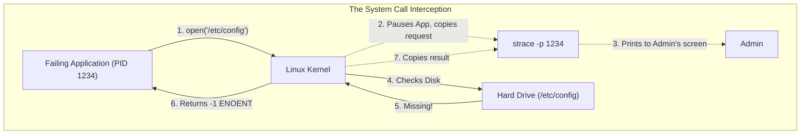
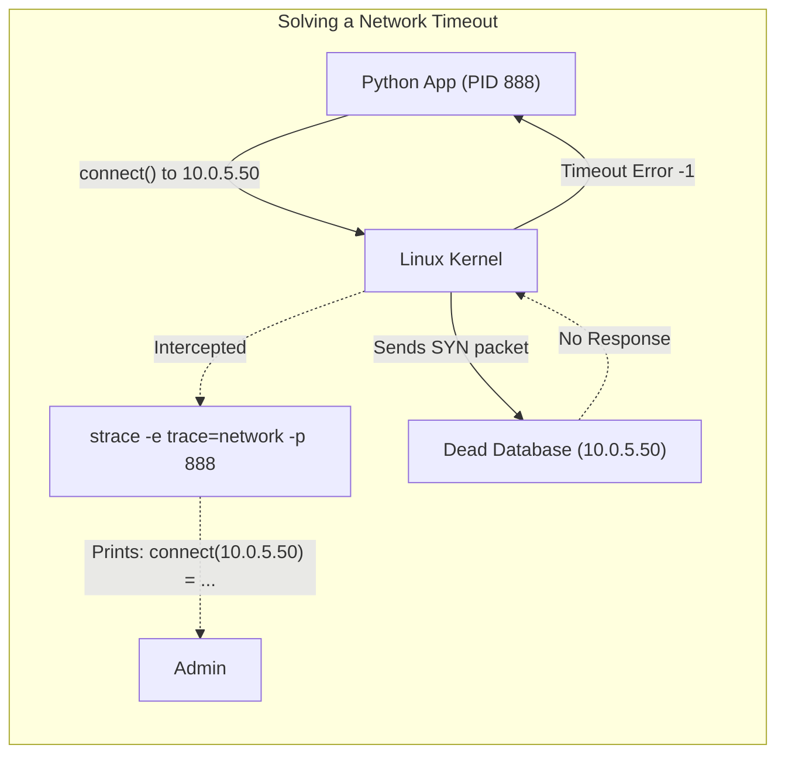
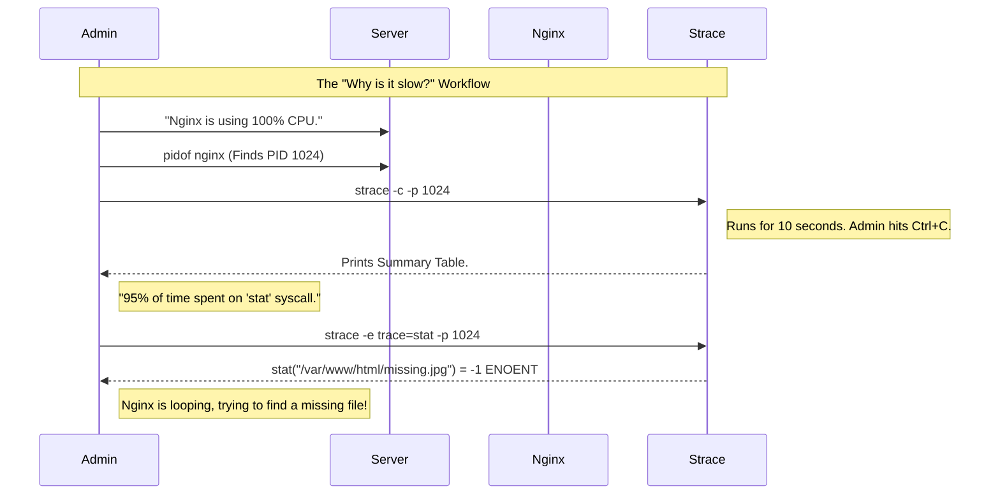

# CHAPTER 78 — STRACE AND APPLICATION DEBUGGING

---

## 1. Introduction

### Why This Topic Exists
Imagine you type `cat /etc/passwd`, and the terminal says `Permission Denied`. That's easy; you fix the permissions. But what if you type a command, and the terminal just hangs forever? Or what if a developer's proprietary application violently crashes with a generic `Error Code 1`, and the developer says, "I don't know, it works on my laptop!" How do you troubleshoot a program when the logs are empty and the developer is clueless? You need a tool that lets you look inside the running application. You need **strace**.

### Why Linux Administrators Use It
Linux administrators use `strace` (System Trace) as the ultimate diagnostic tool. `strace` intercepts and records every single conversation that an application attempts to have with the Linux Kernel. If an application tries to open a file, read a network socket, or allocate RAM, `strace` prints it to the screen in real-time. It completely eliminates guesswork.

### Why Companies Care About It
Mean Time to Resolution (MTTR). When a critical enterprise application crashes, the company loses money for every minute it is down. If an admin spends 4 hours guessing what the problem is, the MTTR is terrible. An advanced administrator can attach `strace` to the broken application, see exactly which file it is failing to read, and fix the outage in 3 minutes.

---

## 2. Learning Objectives

By the end of this chapter, you will be able to:
- Explain the concept of "System Calls" (syscalls).
- Use `strace` to launch and monitor a failing command.
- Attach `strace` to an already-running background daemon (`-p`).
- Filter `strace` output to only show specific events (like file opens or network connections).
- Diagnose common application failures (Missing files, Permission Denied, Network Timeouts).

---

## 3. Beginner-Friendly Explanation

Think of a restaurant:
- **The Application:** The Customer sitting at the table.
- **The Linux Kernel:** The Chef in the kitchen who has the food (Data, Hardware, Network).
- **System Calls (syscalls):** The Waiter. The Customer cannot go into the kitchen. They MUST give an order to the Waiter, who takes it to the Chef.
- **`strace`:** The Restaurant Manager standing next to the table, writing down every single word the Customer says to the Waiter. If the Customer gets angry and leaves, the Manager looks at their notepad and sees: *"Customer asked for file /etc/secret.txt. Chef replied: Permission Denied."* The mystery is solved.

---

## 4. Core Theory

### 4.1 User Space vs Kernel Space
Linux is strictly divided into two areas:
1. **User Space:** Where your applications (Nginx, Python, Bash) live. Applications are unprivileged. They cannot touch the hard drive or the network card.
2. **Kernel Space:** The core OS. It has absolute power over the hardware.
If an application in User Space wants to read a file, it MUST execute a **System Call** (asking the Kernel for permission).

### 4.2 Common System Calls
`strace` will vomit thousands of lines of code at you. You only need to recognize a few key System Calls:
- `openat()` or `open()`: The app is trying to open a file.
- `read()`: The app is reading data from a file or network.
- `write()`: The app is writing data to a file or screen.
- `connect()`: The app is trying to open a network connection (TCP/UDP).
- `stat()`: The app is checking if a file exists and what its permissions are.

### 4.3 Return Values (The Result)
Every System Call has a result, printed at the end of the line after an equals sign `=`.
- `= 0`: Success!
- `= 3`: Success! (The Kernel returned a "File Descriptor" ID number of 3).
- `= -1 ENOENT`: ERROR. (Error No Entry). The file does not exist.
- `= -1 EACCES`: ERROR. (Error Access). Permission denied.

---

## 5. Internal Working

### The `ptrace` Mechanism
How does `strace` actually intercept these calls? It uses a special Kernel feature called `ptrace` (Process Trace). When `strace` attaches to an application, it forces the Linux Kernel to pause the application for a microsecond every time it makes a system call, copy the data to `strace`, and then resume the application. 
Because of this constant pausing, `strace` slows down the target application by up to 50%. You should NOT leave `strace` attached to a high-traffic production database for long periods of time.

---

## 6. Production Architecture



---

## 7. Command-by-Command Explanation

### 7.1 `dnf install strace`
- **Purpose:** Installs the tool (it is not installed by default on many minimal distributions).

### 7.2 `strace ls /root`
- **Purpose:** Runs a command specifically *inside* `strace`. It will print 100 lines of system calls detailing exactly how the `ls` command loads its libraries, checks permissions, and reads the directory, before finally printing the actual `ls` output at the very end.

### 7.3 `strace -p 4567`
- **Purpose:** **The Production Command.** Attaches to a background daemon that is already running (where `4567` is the Process ID of the failing Nginx or Python worker). Press `Ctrl+C` to detach when you are done.

### 7.4 `strace -o /tmp/debug.log -p 4567`
- **Purpose:** Because `strace` output scrolls faster than the human eye can read, the `-o` flag writes all the system calls directly to a log file so you can safely search through it later with `grep` or `vim`.

---

## 8. Syntax Breakdown

**Filtering for Network Issues**

If an application is hanging and you suspect it is trying to talk to a dead server, you don't care about file reads. You only want to see network calls.

```bash
strace -e trace=network -p 4567
│      │              │
│      │              └── The PID of the hanging process
│      └───────────────── The expression (filter). Only show network syscalls (connect, recv, send).
└── The strace command
```
*(You can also use `-e trace=file` to only see file opens, or `-e trace=openat` to be incredibly specific).*

---

## 9. Parameter Explanation

| `strace` Flag | Purpose |
|:---|:---|
| `-p <PID>` | Attach to an existing Process ID. |
| `-e trace=...` | Filter the output (e.g. `file`, `network`, `process`). |
| `-o <file>` | Output everything to a text file. |
| `-c` | Summary Mode. Doesn't print the scrolling text. When you hit `Ctrl+C`, it prints a beautiful table showing exactly how much time the app spent on each syscall. |
| `-f` | Follow forks. If you attach to a master process, and it spawns a child worker, `strace` will automatically attach to the child too. |

---

## 10. Sample Output Analysis

**Scenario:** A developer's script named `run_app` is crashing instantly. We run it in `strace`.
**Command:** `strace ./run_app`

**Output Excerpt:**
```text
execve("./run_app", ["./run_app"], 0x7ffd0b) = 0
openat(AT_FDCWD, "/etc/app_config.ini", O_RDONLY) = -1 ENOENT (No such file or directory)
write(2, "FATAL: Configuration missing\n", 29) = 29
exit_group(1) = ?
```

**Analysis:**
- `execve`: The Kernel executed the program successfully (`= 0`).
- `openat`: The application tried to open `/etc/app_config.ini` in Read-Only mode. The Kernel returned `-1 ENOENT`. **(We found the bug! The config file is missing).**
- `write(2`: The application wrote an error message to File Descriptor 2 (Standard Error).
- `exit_group(1)`: The application crashed and returned Exit Code 1.

---

## 11. Architecture Diagram


*The Admin sees the `connect()` call hanging on the IP `10.0.5.50` and instantly knows the App is frozen because the database is offline, without ever looking at the Python code.*

---

## 12. Workflow Diagram



---

## 13. Real Production Examples

### The Permission Denied Mystery
A service account `backup_user` runs a script. The script fails. The log says "Upload Failed." You check the directory permissions: `drwxrwxrwx`. It is completely open! Why is it failing?
You run `strace -u backup_user ./script.sh`.
In the output, you see:
`openat(AT_FDCWD, "/home/backup_user/.ssh/id_rsa", O_RDONLY) = -1 EACCES (Permission denied)`
**Diagnosis:** The upload directory was perfectly fine. The script failed because the user didn't have read permissions on their own SSH Private Key, meaning the script couldn't authenticate to the remote server! `strace` proved the error was in `.ssh/`, not in the upload folder.

### Finding the Hidden Configuration File
You install a proprietary, closed-source application. It needs a license key, but the documentation is terrible and doesn't tell you *where* to put the `license.txt` file.
You run `strace ./proprietary_app 2>&1 | grep license.txt`.
You see: `openat(AT_FDCWD, "/opt/proprietary/conf/license.txt", O_RDONLY) = -1 ENOENT`
**Diagnosis:** The application revealed its own secret. It is hardcoded to look in `/opt/proprietary/conf/`. You put the file there, and the app starts working perfectly.

---

## 14. Common Mistakes

1. **Forgetting to Redirect Standard Error** — `strace` does NOT print to Standard Output (1). It prints its diagnostics to Standard Error (2) so that it doesn't corrupt the actual application's output. If you try to pipe it: `strace ls | grep open`, it will completely fail. You MUST redirect stderr to stdout first: `strace ls 2>&1 | grep open`.
2. **Leaving Strace Attached** — An admin runs `strace -p <PID>` on the master MySQL process and leaves for lunch. MySQL slows down by 50%. Application latency spikes, and the company loses money. ALWAYS detach (`Ctrl+C`) the exact second you have captured the error.
3. **Being Intimidated by the Output** — `strace` outputs absolute garbage (memory addresses, hex codes). Beginners see this and panic. *Ignore the garbage.* You are only looking for three things: The word `open`, the word `connect`, and the `-1` errors at the end of the lines.

---

## 15. Best Practices

- **Use `ltrace` for Library Calls:** `strace` monitors conversations with the Kernel. If an application is failing because it's talking to a broken C Library (like `glibc` or `OpenSSL`), `strace` won't show it. You use `ltrace` (Library Trace) which has the exact same syntax, but intercepts function calls to libraries in User Space.
- **Save to a file for complex bugs:** If an application only crashes once every 3 hours, use `strace -f -o /tmp/crash.log -p <PID>`. Come back tomorrow, open `/tmp/crash.log`, go to the absolute bottom of the file, and look at the last 5 system calls the application made before it died.

---

## 16. Security Considerations

- **Strace captures Passwords:** Because `strace` reads raw data flowing into `read()` and `write()` calls, if you attach it to an SSH daemon or a database connection, you will see user passwords printed in plain text on your screen. You should be extremely careful who has `root` access (and thus the ability to use `strace`) on jump servers.

---

## 17. Performance Considerations

- **The `-c` Summary Flag:** If a server is under heavy load, do not run standard `strace`. It will flood your terminal and slow the app down. Run `strace -c -p <PID>`. The `-c` (count) flag aggregates the data silently in the background and only prints a lightweight summary table when you stop it, making it much safer for production analysis.

---

## 18. Troubleshooting Guide

| Symptom | Root Cause | Resolution |
|:---|:---|:---|
| `strace: attach: ptrace(PTRACE_SEIZE, 1234): Operation not permitted` | Missing Privileges | You cannot strace a process owned by another user (or root) unless you use `sudo strace`. |
| Piping to `grep` doesn't work | Wrong Data Stream | `strace` outputs to STDERR. Use `strace cmd 2>&1 \| grep ...` |
| Output shows `resumed` and `<unfinished ...>` | Interleaved Threads | The app is multi-threaded. Add the `-f` flag to track children cleanly. |

---

## 19. Practical Labs

**Lab 78.1:** Discovering Missing Files
1. `touch /tmp/test_strace.txt`
2. `sudo dnf install strace -y`
3. Run `strace cat /tmp/test_strace.txt 2>&1 | grep openat`
4. Notice it says `= 3` (Success).
5. Now run it on a fake file: `strace cat /tmp/fake_file.txt 2>&1 | grep openat`
6. Notice the bottom line: `openat(..., "/tmp/fake_file.txt", ...) = -1 ENOENT (No such file or directory)`. You just caught the Kernel rejecting the request!

**Lab 78.2:** The CPU Profiler
1. Start a background sleep process: `sleep 1000 &`
2. Find its PID: `jobs -p` (Let's say it is 5555).
3. Attach with summary mode: `sudo strace -c -p 5555`
4. Wait 5 seconds, then press `Ctrl+C`.
5. Look at the table. It will show exactly how much time the process spent doing nothing (usually waiting on the `restart_syscall`).

---

## 20. Mini Project

The Network Hanger.
You have a script that takes 10 seconds to finish. You want to know why it's so slow.
1. Create a bad script:
   `echo 'curl http://10.255.255.255 --connect-timeout 5' > slow.sh`
   `chmod +x slow.sh`
2. Run it inside strace, filtering for network calls:
   `strace -e trace=network ./slow.sh`
3. Watch the output. You will see a `connect(...)` system call appear, and then the terminal will completely freeze.
4. It freezes for exactly 5 seconds, and then prints `-1 EINPROGRESS`.
5. You have just used `strace` to visually prove that the application is not broken; it is suffering from a Network Timeout!

---

## 21. Assignments

1. What is a "System Call"?
2. What does the return code `-1 ENOENT` mean in `strace` output?
3. Why should you avoid leaving `strace` attached to a high-traffic production application for long periods?

---

## 22. Interview Questions

### Basic
1. **Q: You have a compiled, third-party binary application. It has no logs. When you run it, it instantly crashes. You need to see exactly which files it is trying to read. What command do you use?**
   A: `strace`

2. **Q: In `strace` output, what does `-1 EACCES` mean?**
   A: Error Access. It means the application requested access to a file or socket, but the Linux Kernel denied it due to lack of permissions.

### Intermediate
3. **Q: A Java application (PID 9999) is currently running in the background and is completely frozen. You want to see what System Call it is stuck on right now. What is the exact command?**
   A: `strace -p 9999`

4. **Q: You run `strace ./app | grep config`. You want to find where it opens the config file. However, the output ignores your `grep` and vomits thousands of lines to the screen. Why did the pipe fail, and how do you fix it?**
   A: The pipe `|` only captures Standard Output (File Descriptor 1). `strace` explicitly writes its diagnostics to Standard Error (File Descriptor 2) so it doesn't interfere with the application's real output. To pipe it, I must redirect STDERR to STDOUT using `2>&1`. (e.g., `strace ./app 2>&1 | grep config`).

### Scenario-Based
5. **Q: An Apache Web Server handles 5,000 requests per second. Developers complain the server is running slowly. You suspect an I/O bottleneck, but `iostat` shows the disks are fine. You want to use `strace` to profile the Apache process (PID 100) and see if it is spending all its time executing `open()` or `stat()` system calls. However, if you attach standard `strace`, it will intercept 5,000 requests a second, slowing Apache to a crawl and causing a massive production outage. How do you safely use `strace` to get a statistical breakdown of the system calls without destroying production traffic?**
   A: I will use the Summary flag: `strace -c -p 100`. The `-c` flag tells `strace` not to print the millions of lines of text to the screen (which is what causes the massive IO bottleneck in the terminal). Instead, it silently counts the system calls in memory. I will let it run for 5 seconds, press `Ctrl+C`, and `strace` will print a clean, summarized table showing exactly which system calls consumed the most time, allowing me to diagnose the bottleneck safely.

---

## 23. Chapter Summary and Quick Revision Notes

- **System Call:** How an application (User Space) asks the Kernel (Kernel Space) to do something.
- **`strace`:** Intercepts and logs all System Calls.
- **`openat()` / `connect()`:** The most common calls to look for (Files and Network).
- **`ENOENT`:** Error - File missing.
- **`EACCES`:** Error - Permission Denied.
- **`-p <PID>`:** Attach to a live running process.
- **`-e trace=...`:** Filter output to reduce noise.
- **`-c`:** Summary mode (Safe for production profiling).
- **Redirection:** Must use `2>&1` if you want to pipe `strace` into `grep`.

---

## 24. Cheat Sheet

| Command | Purpose |
|:---|:---|
| `strace <command>` | Trace a command from start to finish |
| `strace -p <PID>` | Attach to a background process |
| `strace -c -p <PID>` | Get a summary table of syscall time |
| `strace -f -p <PID>` | Follow child threads |
| `strace -e trace=file <cmd>` | Only show file-related syscalls |
| `strace -o log.txt <cmd>` | Save output to a file |
| `strace <cmd> 2>&1 \| grep ...`| Search strace output in real-time |
