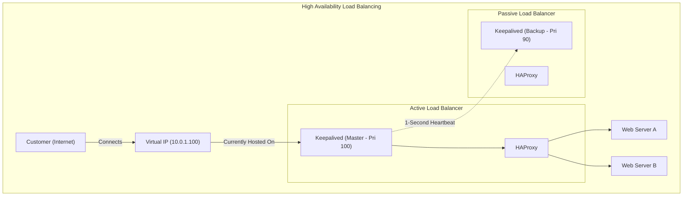
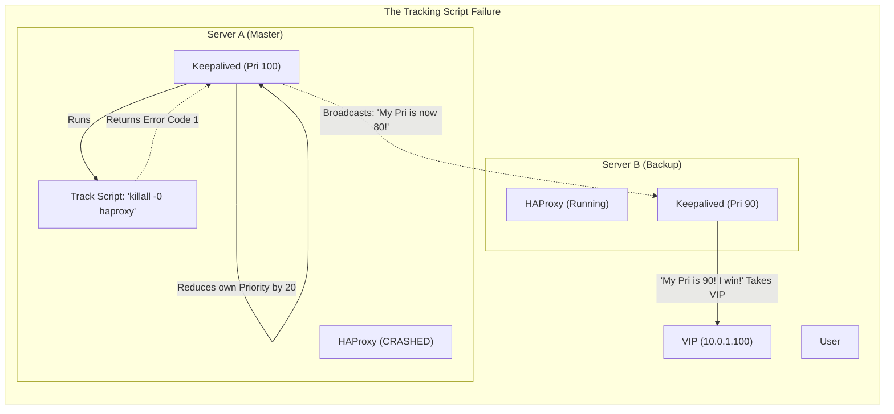
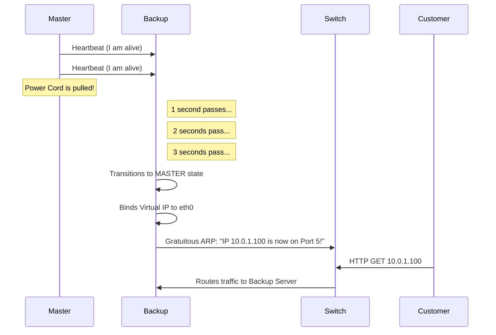

# CHAPTER 80 — HIGH AVAILABILITY AND KEEPALIVED

---

## 1. Introduction

### Why This Topic Exists
In Chapter 59, we learned how to use a Load Balancer (HAProxy/Nginx) to distribute traffic across 5 web servers. If one web server dies, the Load Balancer routes traffic to the other 4. But what happens if the *Load Balancer itself* dies? It is a Single Point of Failure (SPOF). The entire website goes offline. To fix this, you must build **High Availability (HA)** at the networking tier. You need two Load Balancers, but they must share the exact same IP address.

### Why Linux Administrators Use It
Linux administrators use the **VRRP (Virtual Router Redundancy Protocol)**, implemented via the **Keepalived** daemon, to create a "Floating IP Address." Two Linux servers negotiate with each other. The Master server holds the IP address. If the Master server loses power, the Backup server instantly realizes it, steals the IP address, and takes over the traffic without the customer ever noticing a disruption.

### Why Companies Care About It
The 99.999% SLA ("Five Nines"). If a cloud provider guarantees "Five Nines" of availability, it means their servers can only be offline for a maximum of 5 minutes and 15 seconds *per year*. Achieving this is physically impossible with a single server, because applying kernel patches requires a reboot. Companies use Keepalived so they can seamlessly shift traffic away from a server, reboot it, and shift traffic back, achieving zero downtime patching.

---

## 2. Learning Objectives

By the end of this chapter, you will be able to:
- Explain the concept of a Virtual IP (VIP) and the VRRP protocol.
- Install and configure Keepalived to create an Active/Passive cluster.
- Understand the concepts of Priority, Preemption, and Multicast.
- Write a Track Script to monitor the health of a local service (like HAProxy).
- Troubleshoot "Split-Brain" network scenarios.

---

## 3. Beginner-Friendly Explanation

Think of a basketball game:
- **The Ball:** The Virtual IP Address (10.0.1.100). The customers always throw their requests to this exact IP.
- **The Master (The Star Player):** Server A. It holds the ball. It processes all the traffic.
- **The Backup (The Bench Player):** Server B. It sits on the bench, watching the Star Player. It constantly shouts, "Are you okay? Are you okay?" (These are the Keepalived heartbeat packets).
- **The Failover:** The Star Player trips and falls (Server A crashes). The Star Player stops answering. The Bench Player instantly runs onto the court, grabs the ball (the IP Address), and the game continues without the referee even blowing the whistle.

---

## 4. Core Theory

### 4.1 VRRP (Virtual Router Redundancy Protocol)
Keepalived is fundamentally a routing protocol. It operates at Layer 2/3 of the OSI model. The Master server uses the VRRP protocol to broadcast "Heartbeat" packets over the local network every 1 second. The Backup server listens. If 3 seconds pass and the Backup server hears no heartbeats, it assumes the Master is dead and executes the failover.

### 4.2 The Virtual IP (VIP)
A VIP is an IP address that is not permanently tied to a physical network card. It "floats". When a failover occurs, the Backup server assigns the VIP to its own network card, and then sends a **Gratuitous ARP (Address Resolution Protocol)** packet to the network switch. This packet tells the switch: "Hey! The MAC address associated with IP 10.0.1.100 just changed! Send all traffic to my cable now!"

### 4.3 Active/Passive vs Active/Active
- **Active/Passive:** Server A handles 100% of the traffic. Server B handles 0% and just waits. (This is how Keepalived operates by default).
- **Active/Active:** Server A and Server B both handle 50% of the traffic simultaneously. (This requires DNS Round Robin or a specialized hardware load balancer).

---

## 5. Internal Working

### Priority and Preemption
Every Keepalived server is assigned a `priority` number (1-255). The server with the highest number becomes the Master.
- Master: `priority 100`
- Backup: `priority 90`
What happens when the Master crashes? The Backup takes over. 
What happens 10 minutes later when the Master reboots and comes back online? By default, Keepalived uses **Preemption**. The Master wakes up, shouts "I have priority 100!", aggressively steals the IP address back from the Backup, and resumes control. (In some unstable networks, administrators disable Preemption to prevent the IP from bouncing back and forth constantly).

---

## 6. Production Architecture



---

## 7. Command-by-Command Explanation

### 7.1 `dnf install keepalived`
- **Purpose:** Installs the VRRP daemon on both the Master and the Backup servers.

### 7.2 `systemctl enable --now keepalived`
- **Purpose:** Starts the heartbeat engine.

### 7.3 `ip addr show`
- **Purpose:** You CANNOT use `ifconfig` to see a Virtual IP address. `ifconfig` is a legacy tool that only reads primary IP addresses. You MUST use `ip a` to verify if a server has successfully claimed the floating VIP.

### 7.4 `tcpdump -i eth0 vrrp`
- **Purpose:** **The ultimate troubleshooting command.** Tells the network card to sniff the air and print out the raw Keepalived heartbeat packets as they travel between the two servers.

---

## 8. Syntax Breakdown

**Configuring Keepalived (`/etc/keepalived/keepalived.conf`)**

*This file must be created on BOTH servers. They are almost identical, except for the `state` and `priority`.*

```text
vrrp_instance VI_1 {
    state MASTER                # On Server B, this is BACKUP
    interface eth0              # The physical network card to attach the VIP to
    virtual_router_id 51        # A unique ID. Both servers MUST use the same ID!
    priority 100                # On Server B, this is 90
    advert_int 1                # Send a heartbeat every 1 second

    authentication {
        auth_type PASS
        auth_pass Secret123     # Password so random servers can't join the cluster
    }

    virtual_ipaddress {
        10.0.1.100              # THE FLOATING VIRTUAL IP!
    }
}
```

---

## 9. Parameter Explanation

| Configuration Block | Purpose |
|:---|:---|
| `vrrp_script` | A custom bash script that Keepalived runs to check the health of a service. |
| `track_script` | Attaches the `vrrp_script` to the VRRP instance. If the script fails, Keepalived triggers a failover. |
| `nopreempt` | Added to the `vrrp_instance` block to prevent a rebooted Master from violently stealing the IP back from a stable Backup. |
| `unicast_peer` | By default, VRRP uses Multicast (shouting to everyone). Some cloud providers (like AWS) block Multicast. This forces Keepalived to use Unicast (talking directly to one specific IP). |

---

## 10. Sample Output Analysis

**Scenario:** We want to verify the heartbeats are flowing across the network.
**Command:** `tcpdump -i eth0 vrrp`

**Output:**
```text
14:05:01.123456 IP 10.0.1.10 > 224.0.0.18: VRRPv2, Advertisement, vrid 51, prio 100, authtype simple, intvl 1s, length 20
14:05:02.124567 IP 10.0.1.10 > 224.0.0.18: VRRPv2, Advertisement, vrid 51, prio 100, authtype simple, intvl 1s, length 20
```

**Analysis:**
- `10.0.1.10`: This is the Master server's physical IP address.
- `> 224.0.0.18`: The Master is NOT sending the packet to the Backup server. It is sending it to `224.0.0.18`, which is the universal Multicast IP address reserved for VRRP. Any backup server listening on this Multicast channel will hear it.
- `vrid 51, prio 100`: The Master is shouting its ID and its Priority, asserting dominance.

---

## 11. Architecture Diagram


*Keepalived doesn't know what HAProxy is. If HAProxy crashes, but the physical server is still powered on, Keepalived will blindly hold onto the IP address, causing a massive outage. You MUST write a Track Script so Keepalived knows when the application dies.*

---

## 12. Workflow Diagram



---

## 13. Real Production Examples

### The Nginx High Availability Cluster
A company runs a high-traffic e-commerce site. They have two Nginx load balancers.
- **LB-01 (10.0.1.10):** Runs Nginx and Keepalived (Master).
- **LB-02 (10.0.1.20):** Runs Nginx and Keepalived (Backup).
- **VIP:** 10.0.1.100.
The DNS A-Record for `www.company.com` points to `10.0.1.100`.
At 2:00 AM, the administrator needs to upgrade the Linux kernel on LB-01. They type `systemctl stop keepalived`. The VIP instantly jumps to LB-02. The customers don't notice a thing. The admin reboots LB-01. When it comes back online, it steals the VIP back. The admin then repeats the process on LB-02. Zero downtime patching achieved.

### Overcoming AWS Multicast Restrictions
If you deploy Keepalived in AWS or Azure, it will instantly fail. Cloud providers aggressively block Multicast traffic (`224.0.0.18`) at the hypervisor level, because Multicast is often used in DDoS amplification attacks.
To make Keepalived work in the cloud, you must switch it to **Unicast**.
In `keepalived.conf`:
```text
unicast_src_ip 10.0.1.10
unicast_peer {
    10.0.1.20
}
```
*The Master now shoots the heartbeat packets directly, point-to-point, at the Backup server's physical IP address, bypassing the Multicast ban.*

---

## 14. Common Mistakes

1. **The Split-Brain Scenario** — Master and Backup are connected through a network switch. The network switch temporarily crashes. Master is alive. Backup is alive. But they cannot hear each other. Backup thinks Master is dead, so Backup claims the VIP. Master still thinks it is Master, so it holds the VIP. You now have TWO servers on the exact same network claiming the exact same IP address. This is called Split-Brain. It destroys ARP tables and causes catastrophic routing loops.
2. **Forgetting `net.ipv4.ip_nonlocal_bind=1`** — Nginx is configured to listen on the VIP (`listen 10.0.1.100:80`). On the Backup server, the VIP is NOT present on the network card (because the Master has it). When you try to start Nginx on the Backup server, it crashes, saying "Cannot bind to 10.0.1.100: IP does not exist." You must edit `/etc/sysctl.conf` and set `ip_nonlocal_bind=1` to allow Linux programs to bind to IP addresses that aren't physically on the server yet.
3. **Using `ifconfig`** — An admin gets a page that the VIP is offline. They log into the Master, type `ifconfig`, and say, "The VIP isn't here!" The VIP *is* there, but it is attached as a secondary IP. They must use `ip a` to see it.

---

## 15. Best Practices

- **The Tracking Script:** Never run Keepalived without a `vrrp_script`. A server that is powered on, but has a crashed web server, is worse than a dead server.
```text
vrrp_script chk_nginx {
    script "killall -0 nginx"  # Checks if the process exists in RAM
    interval 2                 # Check every 2 seconds
    weight -20                 # If it fails, subtract 20 from priority
}
```

---

## 16. Security Considerations

- **VRRP Passwords:** Always use the `authentication` block in `keepalived.conf`. If you leave it blank, a rogue employee can launch a Linux VM on the corporate network, install Keepalived, set `priority 255`, and instantly hijack your production Virtual IP address, intercepting all customer traffic.

---

## 17. Performance Considerations

- **State Syncing:** Keepalived only moves the IP address. It does NOT move the memory state. If a customer is halfway through downloading a 5GB file from Server A, and Server A crashes, the VIP moves to Server B instantly. However, the customer's TCP connection is severed, and their download fails. For seamless state syncing, advanced tools like `conntrackd` must be deployed alongside Keepalived to synchronize the Linux Kernel connection tables.

---

## 18. Troubleshooting Guide

| Symptom | Root Cause | Resolution |
|:---|:---|:---|
| Split-Brain (Both servers have the VIP) | Firewall blocking VRRP | Run `firewall-cmd --add-protocol=vrrp --permanent` on BOTH servers. |
| Master has the VIP, but can't be pinged | `iptables` strictness | Ensure the firewall allows traffic explicitly destined for the VIP address. |
| Failover works, but web app is broken | Missing `ip_nonlocal_bind` | The app failed to start on the Backup node. Fix `sysctl.conf`. |
| Backup refuses to take over when Master dies | Tracking script bug | Check `/var/log/messages`. The tracking script on the Backup might also be returning an error. |

---

## 19. Practical Labs

**Lab 80.1:** Installing and Configuring (Requires 2 Linux VMs on the same network)
1. Install on both: `sudo dnf install keepalived -y`
2. Configure **Node 1 (192.168.1.10)**:
   - Edit `/etc/keepalived/keepalived.conf`:
   ```text
   vrrp_instance VI_1 {
       state MASTER
       interface eth0
       virtual_router_id 51
       priority 100
       virtual_ipaddress {
           192.168.1.100
       }
   }
   ```
3. Configure **Node 2 (192.168.1.20)**:
   - Copy the exact config, but change `state BACKUP` and `priority 90`.
4. Open firewalls on BOTH: `sudo firewall-cmd --add-protocol=vrrp --permanent && sudo firewall-cmd --reload`
5. Start the service on BOTH: `sudo systemctl start keepalived`

**Lab 80.2:** The Chaos Test
1. On Node 1, verify it has the VIP: `ip a` (You will see 192.168.1.100).
2. On Node 2, verify it does NOT have the VIP: `ip a`.
3. Open a terminal on your Host machine (Laptop) and run a continuous ping:
   `ping 192.168.1.100`
4. Go to Node 1, and violently crash the service: `sudo systemctl stop keepalived`
5. Watch the ping terminal! It might drop a single packet, but it instantly resumes.
6. Check Node 2: `ip a`. The VIP has magically teleported to Node 2!
7. Start Node 1 again. It will preempt Node 2 and steal the IP back.

---

## 20. Mini Project

The Track Script Implementation.
1. Install Nginx on Node 1: `sudo dnf install nginx -y && sudo systemctl start nginx`
2. Edit `/etc/keepalived/keepalived.conf` on Node 1. Add this ABOVE the `vrrp_instance`:
```text
vrrp_script check_web {
    script "killall -0 nginx"
    interval 2
    weight -20
}
```
3. INSIDE the `vrrp_instance` block, add:
```text
track_script {
    check_web
}
```
4. Restart Keepalived.
5. Stop Nginx: `sudo systemctl stop nginx`.
6. Instantly check `ip a`. Keepalived detected that Nginx died, lowered its priority to 80, and surrendered the VIP to the Backup node!

---

## 21. Assignments

1. What is a Virtual IP (VIP), and how does it move from one server to another?
2. What does the term "Split-Brain" mean in a High Availability cluster, and what usually causes it?
3. Why is it dangerous to rely solely on Keepalived without configuring a `vrrp_script` (Tracking Script)?

---

## 22. Interview Questions

### Basic
1. **Q: What command must you use to see a Virtual IP address on a Linux server?**
   A: `ip a` (or `ip addr show`). `ifconfig` will not display it.

2. **Q: In Keepalived, how does the system determine which server is the Master?**
   A: Based on the `priority` configuration. The server with the highest numerical priority number becomes the Master.

### Intermediate
3. **Q: You deploy Keepalived on two AWS EC2 instances. You configure it perfectly. You check the logs, but they are both claiming to be the Master, resulting in a Split-Brain. You check the firewall, and VRRP is allowed. Why does it fail in AWS?**
   A: AWS networks completely block Multicast traffic at the hypervisor level. VRRP uses Multicast by default. I must configure Keepalived to use `unicast_peer` mode so the servers send heartbeats directly to each other's physical IP addresses.

4. **Q: A Junior Admin configures Keepalived. When they start HAProxy on the Backup server, it crashes with the error `Cannot bind to IP: Cannot assign requested address`. How do you fix the Linux Kernel to allow this?**
   A: The application is failing because it is trying to listen on the VIP, but the VIP is not physically present on the Backup server's network card. I must add `net.ipv4.ip_nonlocal_bind=1` to `/etc/sysctl.conf` and run `sysctl -p`. This allows applications to bind to floating IPs that they do not currently possess.

### Scenario-Based
5. **Q: Your company has a massive 5-node Galera Database cluster sitting behind two Keepalived Load Balancers (Master and Backup). Network stability is a known issue; switch ports occasionally flap for 2 seconds and come back. Every time the switch flaps, the Master Keepalived server loses network briefly. The Backup assumes the Master is dead and takes the IP. 3 seconds later, the Master's network comes back. Because the Master has a higher priority, it instantly steals the IP back. This constant back-and-forth bouncing of the IP address is violently severing the database connections and corrupting transactions. How do you configure Keepalived to stop this bouncing behavior, prioritizing stability over hierarchy?**
   A: The problem is caused by Keepalived's default "Preemption" behavior. When the Master wakes up, it aggressively demands the IP address back. To fix this, I must add the `nopreempt` flag to the `vrrp_instance` block on the Master server. With this flag, when the Master recovers from the network flap, it sees that the Backup server has successfully taken control of the VIP, and it peacefully stays in the Backup state. The VIP will remain stable on the second server until another actual failure occurs.

---

## 23. Chapter Summary and Quick Revision Notes

- **Keepalived:** The daemon that provides High Availability via floating Virtual IPs.
- **VRRP:** Virtual Router Redundancy Protocol. The heartbeat protocol. Uses Multicast.
- **VIP (Virtual IP):** An IP that can jump between physical servers.
- **Priority:** Highest number wins the VIP.
- **Preemption:** Master steals the IP back when it recovers. (Can be disabled with `nopreempt`).
- **Tracking Scripts:** Custom scripts that force a failover if an *application* (like Nginx) crashes, rather than waiting for the entire server to crash.
- **Split-Brain:** A disaster where both servers think they are Master due to a network communication failure.
- **`ip_nonlocal_bind`:** Required sysctl setting for applications running on the Backup node.

---

## 24. Cheat Sheet

| Command / Term | Purpose |
|:---|:---|
| `ip a` | View the VIP |
| `tcpdump -i eth0 vrrp` | Troubleshoot heartbeats |
| `sysctl -w net.ipv4.ip_nonlocal_bind=1` | Allow binding to a missing VIP |
| `state MASTER` / `state BACKUP` | Initial role definition |
| `priority 100` | Hierarchy weight |
| `firewall-cmd --add-protocol=vrrp` | Required to prevent Split-Brain |
