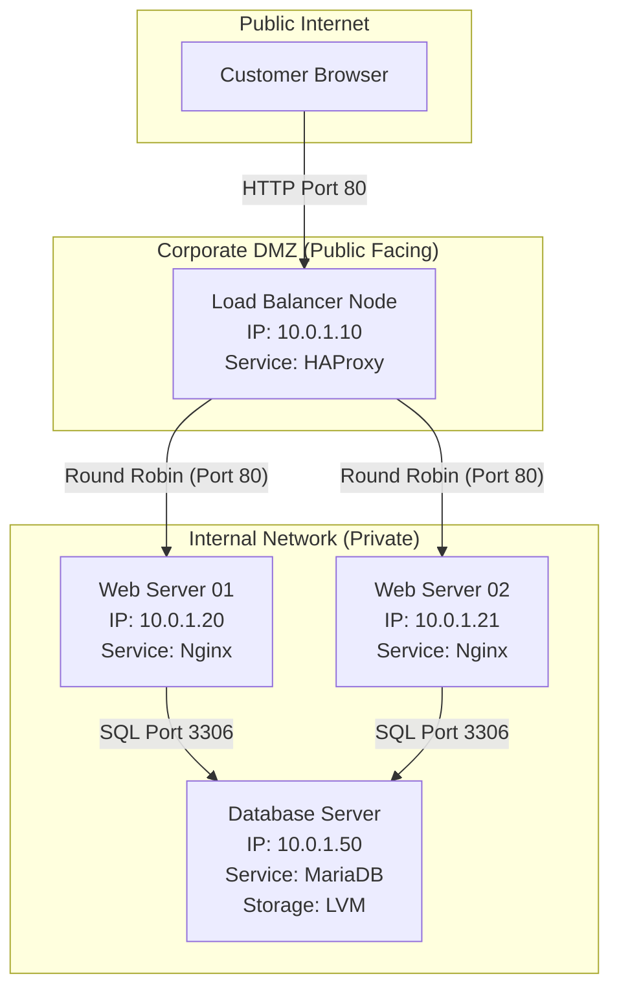

# CHAPTER 85 — THE ENTERPRISE WEB ARCHITECTURE CAPSTONE

---

## 1. Introduction

### Welcome to the End
You have studied 84 chapters of intense Linux theory, from the lowest levels of the Kernel Ring Buffer to the highest levels of Cloud Automation. You have learned how to format hard drives, configure firewalls, manage users, and deploy high availability clusters. Now, it is time to prove it.

### The Purpose of a Capstone
A Capstone project is not a tutorial. It is a simulation of a real-world enterprise deployment. In this project, you will not be given the exact commands. You will be given a set of business requirements, an architectural diagram, and the freedom to build it. If a component breaks, you will use the troubleshooting skills (strace, dmesg, top, logs) you developed throughout this course to fix it.

### The Business Value
If you can successfully complete this Capstone, you are no longer a "Beginner." You have built a 3-tier enterprise architecture. You can put this exact project on your resume under the "Projects" section, and you will be able to speak intelligently about it during any Senior Systems Administrator interview.

---

## 2. The Business Requirements

The Company, "Penguin E-Commerce," needs a new highly available, secure web architecture to host their new blog.
They have purchased 4 blank Linux servers.
You have been hired as the Senior Linux Architect to build the infrastructure.

### The Technical Requirements
1. **The Web Tier:** Two Nginx web servers to serve the HTML content.
2. **The Database Tier:** One dedicated MariaDB/MySQL database server.
3. **The Load Balancer:** One HAProxy server to distribute traffic equally to the two Nginx web servers.
4. **Security:** All servers must have SELinux running in Enforcing mode. All servers must have a strict firewall. Only the Load Balancer is allowed to be accessed from the public internet on Port 80.
5. **Storage Management:** The database server must use LVM (Logical Volume Management) so the storage can be expanded in the future without downtime.
6. **Automation:** The web servers must be provisioned using an Ansible Playbook, not manually.

---

## 3. The Enterprise Architecture Diagram



---

## 4. Phase 1: Infrastructure Provisioning

**Objective:** Set up the virtual environment.

1. Install VirtualBox, VMware, or use an AWS account.
2. Deploy 4 virtual machines running RHEL 9, Rocky Linux 9, or Ubuntu 22.04.
3. Ensure they can all ping each other.
4. From your host machine (or a 5th "Control Node" VM), generate an SSH Key Pair and distribute the Public Key to all 4 servers using `ssh-copy-id`. You must be able to log into all 4 servers without typing a password.

---

## 5. Phase 2: The Database Tier (LVM and MariaDB)

**Objective:** Build a scalable, secure database.

1. Add a second virtual hard drive (e.g., 5GB `sdb`) to the Database VM.
2. Use LVM to create a Physical Volume (`pvcreate`), a Volume Group (`vgcreate`), and a Logical Volume (`lvcreate`) named `db_data`.
3. Format the Logical Volume with the `xfs` filesystem.
4. Mount it permanently by editing `/etc/fstab` to mount at `/var/lib/mysql`.
5. Install the `mariadb-server` package.
6. Configure `firewalld` to allow Port 3306, but ONLY from the IP addresses of the two Web Servers.
7. Start the database service.
8. Run `mysql_secure_installation` to set a root password.
9. Log into the database and create a user `web_app` with the password `Secret123`, and grant it access to a new database named `ecommerce_db`.

---

## 6. Phase 3: The Automation Tier (Ansible)

**Objective:** Write Infrastructure as Code to deploy the Web Servers perfectly symmetrically.

1. On your Control Node, create a directory for your Ansible project.
2. Create an `inventory.ini` file containing the IP addresses of Web1 and Web2 under a `[webservers]` group.
3. Write a YAML playbook (`deploy_web.yml`) that does the following:
   - Installs the `nginx` package.
   - Installs the `php-fpm` and `php-mysqlnd` packages (so Nginx can talk to MariaDB).
   - Starts and enables both `nginx` and `php-fpm` services.
   - Configures `firewalld` to open Port 80.
   - Uses the `ansible.builtin.copy` module to deploy a custom `index.php` file to `/usr/share/nginx/html/` that contains a simple script to test the database connection.
4. Run the playbook: `ansible-playbook -i inventory.ini deploy_web.yml`.
5. Verify the playbook is idempotent by running it a second time.

*(Hint: An example `index.php` connection test script):*
```php
<?php
$conn = new mysqli("10.0.1.50", "web_app", "Secret123", "ecommerce_db");
if ($conn->connect_error) {
    die("Database Connection Failed: " . $conn->connect_error);
}
echo "<h1>Success! Connected to the Database from " . gethostname() . "</h1>";
?>
```

---

## 7. Phase 4: The Load Balancer Tier (HAProxy)

**Objective:** Distribute the traffic.

1. Log into the Load Balancer VM.
2. Install the `haproxy` package.
3. Open `/etc/haproxy/haproxy.cfg`.
4. Configure the `frontend` to listen on Port 80.
5. Configure the `backend` to point to the IP addresses of Web Server 01 and Web Server 02 on Port 80.
6. Start the HAProxy service.
7. Open Port 80 on the firewall.
8. Set SELinux Boolean `haproxy_connect_any` to `1` so HAProxy is allowed to route traffic through the network.

---

## 8. Phase 5: Testing and Validation

**The Final Test:**
1. Open a web browser on your physical laptop.
2. Type the IP address of the **Load Balancer** into the URL bar.
3. You should see a webpage that says: *"Success! Connected to the Database from Web1"*.
4. Refresh the page!
5. Because HAProxy uses Round Robin, the page should instantly change to say: *"Success! Connected to the Database from Web2"*.

**The Disaster Test:**
1. Log into Web Server 1.
2. Run `systemctl stop nginx`.
3. Go back to your web browser and refresh the page rapidly.
4. You should NOT see an error! HAProxy should detect that Web 1 is dead, and seamlessly route 100% of your traffic to Web 2. 

**Congratulations. You have built a highly available, enterprise-grade Linux architecture.**

---

## 9. Final Words from the Author

Linux is not just an operating system. It is the invisible engine that powers the modern world. Every time you send an email, watch a Netflix movie, trade a stock, or launch a rocket into space, you are relying on the stability and security of the Linux Kernel.

By completing this Master Course, you have gained a superpower. You understand how the digital world works at its lowest, most fundamental level. Do not stop here. Keep breaking things in your home lab. Keep reading `man` pages. Keep exploring.

The command line is yours. 

**End of Course.**
